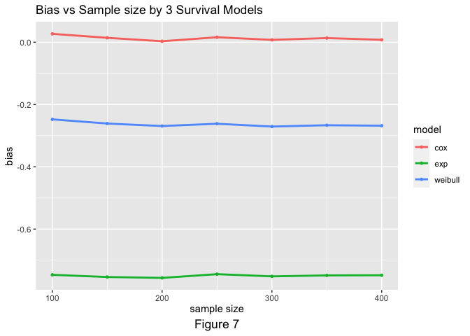
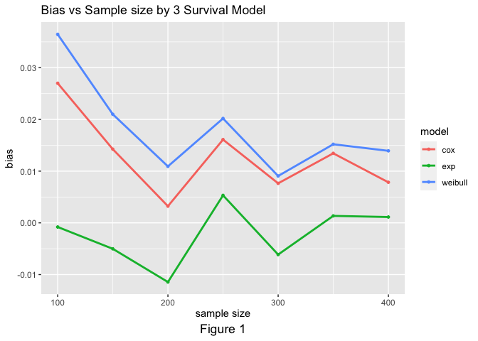

P8160_Project1_Survival
================
Yi Huang, yh3554
2023-02-19

# Project 1: Design a simulation study to compare three survival models

## Simsurv Package Data Generarion Examples

``` r
set.seed(2023)
# tot number of patients
N <- 1000

# define covariates
covs <- data.frame(id = 1:N, trt = stats::rbinom(N, 1, 0.5))

## Exponential
exp_dist <- simsurv(dist = "gompertz", lambdas = 0.5, gammas = 0.05, 
                    x = covs, betas = c(trt = -0.5), maxt = 5)


## Weibull
weibull_dist <- simsurv(dist <- "weibull", lambdas = 0.5, gammas = 0.05, 
                        x = covs, betas = c(trt = -0.5), maxt = 5)


## Gompertz
gompertz_dist <- simsurv(dist = "gompertz", lambdas = 0.1, gammas = 0.05, 
                         x = covs, betas = c(trt = -0.5), maxt = 5)

## Mixture of 
```

## Generate Gompertz distribution use inverse transformation method

``` r
gen_gompertz <- function(alpha, lambda, b1, n, seed) {
  # Generate a random sample from the uniform distribution
  set.seed(seed)
  u <- runif(n)
  x <- rep(0, n)
  x <- (1/alpha)*log(1-(alpha*log(u)/(lambda*exp(x*b1)))) 

  return(x)
}

sample_gompertz <- gen_gompertz(0.5, 0.5, 0.5, 1000, 123123)
df <- data.frame(sample_gompertz)

# Visualization to validate the algorithm
 df %>% ggplot(aes(x = sample_gompertz)) +
  geom_histogram(aes(y = after_stat(density)),
                 colour = 1, fill = "red", bins = 30) +
  geom_density() + xlab("x") + ggtitle("Density Distribution")
```

<!-- -->

## Generate multiple Gompertz distribution using simsurv package

``` r
generate_gompertz = function(gamma, N, seed){
  set.seed(seed)
  #sim gompertz data
  covs <- data.frame(id = 1:N,
                    trt = stats::rbinom(N, 1, 0.5))
  dat <- simsurv(dist = "gompertz",
                 lambdas = 0.5, 
                 gammas = gamma, 
                 betas = c(trt = -0.5), 
                 x = covs, 
                 maxt = 5)
  dat <- merge(covs, dat)
  return(dat)
}
gompertz_dat <- generate_gompertz(1, 1000, 2023)

eventtime <- data.frame(gompertz_dat$eventtime)

# Visualization to validate the algorithm
eventtime %>% ggplot(aes(x = gompertz_dat.eventtime)) +
  geom_histogram(aes(y = after_stat(density)),
                 colour = 1, fill = "red", bins = 30) +
  geom_density() + xlab("x") + ggtitle("Density Distribution")
```

<!-- -->

## fit model

``` r
# fit Exponential
fit.exponential <- survreg(Surv(eventtime, status) ~ trt, data = gompertz_dat, dist = "exponential") 
summary(fit.exponential)
```

    ## 
    ## Call:
    ## survreg(formula = Surv(eventtime, status) ~ trt, data = gompertz_dat, 
    ##     dist = "exponential")
    ##               Value Std. Error     z     p
    ## (Intercept) -0.0559     0.0440 -1.27 2e-01
    ## trt          0.2290     0.0633  3.62 3e-04
    ## 
    ## Scale fixed at 1 
    ## 
    ## Exponential distribution
    ## Loglik(model)= -1054.7   Loglik(intercept only)= -1061.2
    ##  Chisq= 13.1 on 1 degrees of freedom, p= 3e-04 
    ## Number of Newton-Raphson Iterations: 4 
    ## n= 1000

``` r
-fit.exponential$coefficients[-1]
```

    ##        trt 
    ## -0.2289529

``` r
# fit Weibull
fit.weibull <- survreg(Surv(eventtime, status) ~ trt, data = gompertz_dat, dist = "weibull") 
summary(fit.weibull)
```

    ## 
    ## Call:
    ## survreg(formula = Surv(eventtime, status) ~ trt, data = gompertz_dat, 
    ##     dist = "weibull")
    ##               Value Std. Error      z       p
    ## (Intercept)  0.0462     0.0295   1.57    0.12
    ## trt          0.2192     0.0414   5.30 1.2e-07
    ## Log(scale)  -0.4247     0.0260 -16.32 < 2e-16
    ## 
    ## Scale= 0.654 
    ## 
    ## Weibull distribution
    ## Loglik(model)= -943.7   Loglik(intercept only)= -957.5
    ##  Chisq= 27.62 on 1 degrees of freedom, p= 1.5e-07 
    ## Number of Newton-Raphson Iterations: 6 
    ## n= 1000

``` r
-fit.weibull$coefficients[-1] / fit.weibull$scale
```

    ##        trt 
    ## -0.3351914

``` r
#fit Cox model
fit.cox <- coxph(Surv(eventtime, status) ~ trt, data = gompertz_dat) 
summary(fit.cox)
```

    ## Call:
    ## coxph(formula = Surv(eventtime, status) ~ trt, data = gompertz_dat)
    ## 
    ##   n= 1000, number of events= 1000 
    ## 
    ##         coef exp(coef) se(coef)      z Pr(>|z|)    
    ## trt -0.40092   0.66970  0.06465 -6.201  5.6e-10 ***
    ## ---
    ## Signif. codes:  0 '***' 0.001 '**' 0.01 '*' 0.05 '.' 0.1 ' ' 1
    ## 
    ##     exp(coef) exp(-coef) lower .95 upper .95
    ## trt    0.6697      1.493      0.59    0.7602
    ## 
    ## Concordance= 0.547  (se = 0.009 )
    ## Likelihood ratio test= 38.46  on 1 df,   p=6e-10
    ## Wald test            = 38.46  on 1 df,   p=6e-10
    ## Score (logrank) test = 38.93  on 1 df,   p=4e-10

# Shape of Survival Function

# Simulation for Gompertz

``` r
sim_gompertz <- function(gamma, N, seed){
  set.seed(seed)
  #sim gompertz data
  covs <- data.frame(id = 1:N,
                    trt = stats::rbinom(N, 1L, 0.5))
  dat <- simsurv(dist = "gompertz",
                 lambdas = 0.5, 
                 gammas = gamma, 
                 betas = c(trt = -0.5), 
                 x = covs, 
                 maxt = 5)
  dat <- merge(covs, dat)
  betas <- -0.5
  
  #fit models
  fit.exponential <- survreg(Surv(eventtime, status) ~ trt, data = dat, dist = "exponential")
  fit.weibull <- survreg(Surv(eventtime, status) ~ trt, data = dat, dist = "weibull")
  fit.cox <- coxph(Surv(eventtime, status) ~ trt, data = dat)
  
  #extract beta
  result <- tibble(exp_beta = c(-fit.exponential$coefficients[-1]), 
                  weibull_beta = c(-fit.weibull$coefficients[-1])/fit.weibull$scale,
                  cox_beta = c(fit.cox$coefficients), 
                  dist = "gompertz",
                  beta = betas, 
                  gamma = gamma,
                  N = N)
  return(result)
}

sim_gompertz(gamma = 0.05, N = 1000, seed = 2023)
```

    ## # A tibble: 1 × 7
    ##   exp_beta weibull_beta cox_beta dist      beta gamma     N
    ##      <dbl>        <dbl>    <dbl> <chr>    <dbl> <dbl> <dbl>
    ## 1   -0.408       -0.406   -0.408 gompertz  -0.5  0.05  1000

# result

``` r
#gamma=0.05
results0 = map_dfr(.x = c(rep(0.05, 1000)), 
        ~sim_gompertz(gamma = .x, N = 1000, seed = 2023))
write.csv(results0,"results_gamma0.05.csv")
#gamma=1
results1 = map_dfr(.x = c(rep(1, 1000)), 
        ~sim_gompertz(gamma = .x, N = 1000, seed = 2023))
write.csv(results1,"results_gamma1.csv")
#gamma=2
results2 = map_dfr(.x = c(rep(2, 1000)), 
        ~sim_gompertz(gamma = .x, N = 1000, seed = 2023))
write.csv(results2,"results_gamma2.csv")
```
