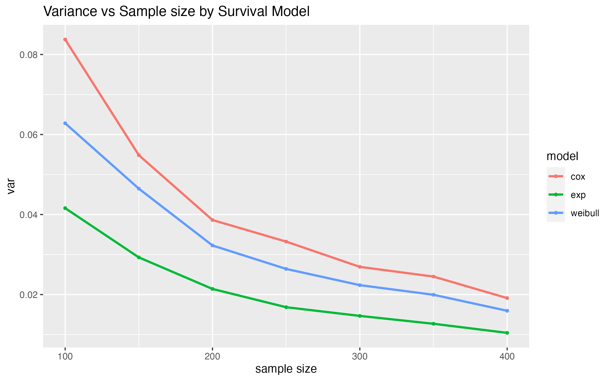

---
title: "P8160 Project 1 Final Report" 
subtitle: "A Simulation Study to Compare Three Survival Models"
date: "March 3, 2023"
author: "Jingchen Chai, Yi Huang, Ruihan Zhang"
output:
  pdf_document:
    toc: yes
    toc_depth: 2
  keep_tex: true
  html_document:
    df_print: paged
    toc: yes
    toc_depth: '2'
header-includes:
- \usepackage{hyperref}
- \hypersetup{colorlinks=false, linktoc=all, linkcolor=red}
- \AtBeginDocument{\addtocontents{toc}{\protect\hypertarget{mylink}{}\hspace{0.25in}\hspace{0.5in}\par}}
- \usepackage{placeins}
- \usepackage{caption}
- \usepackage{fancyhdr}
- \usepackage{lipsum}
- \pagestyle{fancy}
- \fancyhead[R]{\thepage}
# - \fancypagestyle{plain}{\pagestyle{fancy}}

--- 

```{r setup, include=FALSE}
knitr::opts_chunk$set(echo = TRUE, message = FALSE, warning = FALSE, results = 'asis', fig.align = "center")
```

\newpage
```{r,include=FALSE}
library(ggplot2)
```

# Abstract
Survival analysis or time-to-event analysis is commonly used in medical, economics, and engineering research. In survival analysis, each observation unit will be an individual or a patient, the analysis of a variable that corresponds to the time from a defined baseline until the occurrence of an event of interest. The objective of the simulation study is to evaluate the robustness of three survival models against the misspecified baseline hazard functions. To achieve this goal, we assess the accuracy and efficiency of the estimated treatment effects ($\beta$) for each model under various baseline hazard functions. This project will perform simulations to compare the parametric regression model (Exponential and Weibull) to the semi-parametric regression model (Cox) for survival data. We apply the inverse transformation method to generate survival data with censored observations from Exponential, Weibull, Gompertz, and Two-component mixture distributions. Despite the different models, we observed that appropriate baseline hazard results in the best performance.


# Introduction
Survival analysis is a statistical method used to analyze time-to-event data, such as the time until a patient’s death. It is commonly used in medical research to estimate the probability of an event occurring over time and to identify factors that may affect the risk of the event. The analysis also considers time-dependent covariates that vary over time and can be used to compare the survival times between different groups of patients. The uncensored data is recorded when the event occurs at the exact observed event time, and it is coded as 1 in the status indicator variable. Conversely, censored data occurs when patients are lost to follow-up or the event happens after the study period, and it is coded as 0 in the status indicator variable. Time-dependent covariates are also considered in the analysis, which can vary over time and can be used to compare the survival times of different participant groups, such as a treatment group and a control group.

# Objective
The objective is to design a simulation study to compare and contrast the efficiency and accuracy of the estimated treatment effects under different baseline hazard functions and assess their robustness against misspecified baseline hazard functions. A practical and effective recommendation will be provided to general users to select a suitable model on the basis of the numerical investigations. 

# Background

## Survival function, CDF of survival time, hazard function
Let $T\in(0,\infty)$ denote the survival time for a patient. Survival function, $S(t)$ is the probability of observing individual survival time $T$ beyond a certain time $t$. To analyze survival data, we define a **survival function** $S(t)$ as
$$S(t) = \operatorname{Pr}(T > t) = \int_t^\infty f(s) ds$$
The Cumulative distribution function of the random variable survival time $T$, F(t) is the probability of observing individual survival time less than a certain time t, we define **CDF of survival time** $F(t)$ as
$$F(t) = Pr(T \leq t) = 1 - S(t) = 1 - \int_t^{\infty}f(s) ds$$
The Hazard function, $h(t)$ measures the instantaneous risk of failure at time $t$ giving that a patient has survived until time $t$, defined as the ratio of the probability density function of time variable and Survival function. 
$$h(t) = \displaystyle{\lim_{\Delta_t \to 0}}\frac{Pr((T\in(t,t+\Delta_t)|T>t)}{\Delta_t} = \frac{f(t)}{S(t)}$$
Cumulative Hazard Function $H(t)$ can be expressed as
$$H(t) = \int_t^{\infty}h(s)ds$$

## Intro to Proportional hazard model 
Proportional hazard model is the primary regression model to investigate the effectiveness of treatment $X$ over survival time $T$, where the i-th patient at a time $t$ \
is\
$$h_i(t) = h_0(t)e^{x_i\beta}$$
where

\begin{itemize}

\item $h_0(t)$ is the baseline hazard function

\item $x_i$ is is the treatment indicator variable (control = 0, treatment = 1)

\item $\beta$ is the parameter of interest, which is the log hazard ratio for the treatment effect. $\beta$ measures the relative hazard reduction due to treatment in comparison to the control.

\end{itemize}

The **proportional hazard** can be expressed as ratio of two hazard functions at time t given individuals in different treatment groups, and does not depend on $t$. 

$$\frac{h(t|x_0)}{h(t|x_1)} = e^{\beta({x_0-x_1})}$$


There are different ways to formulate the baseline hazard function $h_0(t)$, which lead to different models and estimations. 

## Three Proportional-hazards model

**An exponential proportional-hazards model** assumes the baseline hazard function is a constant $$h_0(t) = \lambda$$ 

**A Weibull proportional-hazards model** assumes the baseline hazard function  follows Weibull distribution, where $$h_0(t) = \lambda\gamma t^{\gamma-1}$$ for $\gamma>0$ 

**A Cox proportional-hazards model** leaves $h_0(t)$ unspecified.

Note that exponential distribution is a special case of Weibull distribution where $\lambda =1$. Hence, among the three models,  the exponential proportional-hazards model is the most restrictive model, while the Cox model is the most general one.

# Methodology
## Data Generation: derive survival time T

Given:\
\
$$H(t)=-\log{(S(t))}$$
$$S(t)=e^{-H(t)}=e^{\int_t^\infty h(s)ds}$$

Utilize Inverse Transformation Method\

$$T = F^{-1}(U) = H_0^{-1}(\frac{-\log{(U)}}{e^{X\beta}})$$
where $U\sim U(0,1)$

Thus, we can derive the following table

\begin{center}
\captionof{table}{Characteristic of Exponential, Weibull and Gompertz Distributions}
\begin{tabular}{|l|l|l|l|}
\hline 
 & Distribution   \\ \hline
 & Exponential & Weibull & Gompertz \\ \hline
Scale Parameter & $\lambda >0$ & $\lambda >0$ & $\lambda >0$ \\ \hline
Shape Parameter & $ $          & $\gamma >0 $ & $\alpha \in (-\infty,\infty)$ \\ \hline
Baseline Hazard function & $h_0(t) = \lambda$ & $h_0(t) = \lambda\gamma t^{\gamma-1}$ & $h_0(t) = \lambda\exp(\alpha t)$ \\ \hline
Cumulative Baseline Hazard Function  & $H_0(t) = \lambda t$ & $H_0(t) = \lambda t^{\gamma}$ & $H_0(t) = \frac{\lambda}{\alpha}(e^{\alpha t}-1)$ \\ \hline
Inverse Cumulative Hazard Function & $H^{-1}(t) = \lambda^{-1}t$ & $H^{-1}(t) = (\lambda^{-1}t)^{\frac{1}{\gamma}}$ & $H^{-1}(T) = \frac{1}{\alpha}\log{(1+\frac{\alpha}{\lambda}t)}$ \\ \hline
Cumulative Distribution Function & $F(t) = 1-e^{t\lambda e^{X\beta}}$ & $F(t) = 1-e^{-\lambda t^\gamma e^{X\beta}}$ & $F(t) = 1-e^{-\frac{\lambda}{\alpha}(e^{\alpha}-1)e^{X\beta}}$\\
 \hline
Survival Time $T$ & $T=-\frac{log{(U)}}{\lambda e^{X\beta}}$ & $T=(-\frac{log{(U)}}{\lambda e^{X\beta}})^{\frac{1}{\gamma}}$ & $T=\frac{1}{\alpha}log{[1-\frac{\alpha \log{(U)}}{\lambda e^{X\beta}}]}$ \\
 \hline
\end{tabular}
\end{center}

## Simulation Design

The goal of this simulation study is to evaluate how misspecifying the baseline hazard function influences the estimated treatment effect from 3 models. We generate 4 types of data, Exponential, Weibull, Gompertz, and Mixture distribution to evaluated the model robustness. All simulation data was generated using inverse transformation method and use `simsurv` function in the `simsurv` package to double check the result. The resulting dataset contains time of event (`eventtime`), status indicator (`status`), and treatment group (`trt`) with censored observations. 

\begin{itemize}
\item Define Random Variable $X$, treatment, from a binomial distribution with $p=0.5$
\item Generate survival time $T$, time to event, using $X$ and $\beta$
\item Randomly generate censoring time $C$, from an exponential distribution
\item We observe either the survival time T or else the censoring time C. 
Specifically, we observe the random variable $Y$ takes the minimum value between survival time and censoring time
\end{itemize}
$$Y =min(T,C)$$
Create a status indicator variable (1 = event, 0 = censored), if the patient dies before censoring time, then status equals one, vice versa.
$$
Status = 
    \begin{cases}
      1, & T_{i}\le C_{i} \\
      0, &  T_{i} > C_{i}
    \end{cases}
$$

### Define true treatment effect and parameter

Before running the simulation, also need to define the true treatment effect and parameters

1. True treatment effect $\beta = 2$
2. 7 different sample size N ranging from 100 to 400 increasing by 50 
3. Simulate exponential distribution with $\lambda=0.5$
4. Simulate weibull distribution with $\lambda=0.5$ and $\gamma=2$
5. Simulate gompertz distribution with $\lambda=0.5$ and $\alpha=2$

### Simulation Times

A large number of simulations can improve the accuracy and efficiency of estimated treatment effect, thus we simulate 1000 times for N sample. Each datasets will be used to fit in three proportional hazard models to obtain the estimated treatment effects 

### Performance Measures
To compare accuracy and efficiency of estimated treatment effects, we use performance measures such as Bias, Variance, Mean square error, and confidence interval to compare 3 models.

$k$: number of independent datasets

#### Estimation

$$Bias = \frac{1}{k}\sum_{i=1}^k(\hat{\beta^{(k)}}-\beta)=\frac{1}{k}\sum_{i=1}^k(\hat{\beta^{(k)}}-2)$$
$$Variance = \frac{1}{k-1}\sum_{i=1}^k\hat{(\beta^{(k)}}-\beta)^2= \frac{1}{k-1}\sum_{i=1}^k\hat{(\beta^{(k)}}-2)^2$$
$$MSE = \frac{1}{k}\sum_{i=1}^k(\hat{\beta^{(k)}}-\beta)^2 = \frac{1}{k}\sum_{i=1}^k(\hat{\beta^{(k)}}-2)^2$$

#### Confidence Interval

$$Coverage: \frac{1}{k}\sum_{i=1}^kI\{\beta\in CI^{(k)}\}$$

# Results and Discussion 

The parameters in each model were held constant with $\lambda = 0.5$, $\gamma=2$, $\alpha = 2$, $\beta = 2$. Each scenario are simulated for 1000 times, sample sizes from 100 to 400. The variance was calculated to examine the efficiency of the models. Additionally, MSE and bias were calculated to demonstrate the performance of survival models as the sample size increases. After running the three models in each scenario, a set of $\beta$'s were extracted and used to calculate the 95%  confidence interval for comparison. 

## Scenario 1: Exponential baseline hazard function

Figure 1 shows the variance from an exponential distribution. We can obviously see from the plot that the exponential model has the lowest versatility, whereas the cox model has the largest. 

```{r,echo=FALSE,out.width='80%',out.height='130%',fig.align='center'}

```
\begin{center}
Figure 1
\end{center}

Figure 2-3 shows the bias and MSE from the exponential distribution. As the sample size increased, the MSE of all three models decreased. The Cox model had the MSE, whereas the exponential model had the least.  The trend of the bias of the three models switched between increasing and decreasing with the increasing sample size. The Weibull model had the largest bias, and the exponential model had the least bias. Therefore, the exponential model is the most suitable model when fitting the data generated from an exponential distribution.


```{r,echo=FALSE,out.width='80%',out.height='130%',fig.align='center'}
knitr::include_graphics("graphs/2.png")
```
\begin{center}
Figure 2
\end{center}

```{r,echo=FALSE,out.width='80%',out.height='130%',fig.align='center'}
knitr::include_graphics("graphs/3.png")
```
\begin{center}
Figure 3
\end{center}


## Scenario 2: Weibull baseline hazard function

Figure 4 shows the variance from a weibull distribution. The exponential model shows to have the lowest versatility, while the cox model has the largest.


```{r,echo=FALSE,out.width='80%',out.height='130%',fig.align='center'}
knitr::include_graphics("graphs/4.png")
```
\begin{center}
Figure 4
\end{center}

Figure 5-6 shows the bias and MSE from the weibull distribution. When looking at the bias plot, the exponential model has the largest bias, while the cox model and Weibull model both perform well with a low bias. From mse plot, weibull fits the data better than cox model when sample size is less than 300, for more than 300, cox and weibull model has a nearly equivalent prediction accuracy. Thus, weibull and cox both fit data from weibull distribution. Cox model outperforms weibull for large sample sizes.


```{r,echo=FALSE,out.width='80%',out.height='130%',fig.align='center'}
knitr::include_graphics("graphs/5.png")
```
\begin{center}
Figure 5
\end{center}


```{r,echo=FALSE,out.width='80%',out.height='130%',fig.align='center'}
knitr::include_graphics("graphs/6.png")
```
\begin{center}
Figure 6
\end{center}


## Scenario 3: Gompertz baseline hazard function

Figure 7 shows the variance from a gomperz distribution. The exponential model shows to have the lowest versatility, while the cox model has the largest. 


```{r,echo=FALSE,out.width='80%',out.height='130%',fig.align='center'}
knitr::include_graphics("graphs/7.png")
```
\begin{center}
Figure 7
\end{center}

Figure 8-9 shows the bias and MSE from the weibull distribution. The mse and bias has similar trends under the three models, the cox model performs well with the lowest bias and mse, while exponential performs the worst.

```{r,echo=FALSE,out.width='80%',out.height='130%',fig.align='center'}
knitr::include_graphics("graphs/8.png")
```
\begin{center}
Figure 8
\end{center}

```{r,echo=FALSE,out.width='80%',out.height='130%',fig.align='center'}
knitr::include_graphics("graphs/9.png")
```
\begin{center}
Figure 9
\end{center}

From above scenarios, we found that for an exponential model, the only case it has the highest prediction accuracy is when the true distribution is a purely exponential. The big difference in performances of exponential models in different distributions shows that it is the least robust against a misspecified distribution. On the other hand, the variance plot shows that the exponential model constantly has the lowest versatility. When the distribution is weibull, both the weibull and cox model performs well. However, when the true distribution is gompertz, only the cox model shows to have the best performance.

Table 2 shows the  95% confidence intervals of three models using 1000 simulations with sample size of 400 and $\beta = 2$.

\begin{center}
\captionof{table}{$95\%$ CI of Estimated Treatment Effect from Three Models}
\begin{tabular}{|l|l|l|l|}
\hline 
Model/Distribution & Exponential & Weibull & Gompertz \\ \hline
Exponential & $(1.80,2.2)$ & $(0.9,1.1)$ & $(1.12,1.39)$ \\ \hline
Weibull & $(1.79,2.28)$ & $(1.76,2.29)$ & $(1.53,1.98)$ \\ \hline
Cox & $(1.76,2.31)$ & $(1.74,2.31)$ & $(1.76,2.31)$ \\ \hline
 
\end{tabular}
\end{center}
\
With the true baseline hazard as exponential, the exponential proportional model has a narrower confidence interval than the other 2 models, and all contain the true beta.
With a weibull baseline hazard, the weibull model provides the most accurate estimation of the treatment effect as expected, with a narrow confidence interval. Cox performs the second best, with a wider confidence interval, but the exponential model significantly deviates from the true treatment and its confidence interval fails to capture the true beta.
Under the Gompertz baseline hazard, both exponential and weibull proportional models deviate from the true beta and their 95% confidence intervals fail to include the true beta. The cox model, which makes no assumption about the baseline hazard, fits well. 

## Additional Cases

### Mix Distribution

In this case, we tried to mix exponential and weibull distribution together, each distribution constitute half. Similar with the above 3 three scenarios, we simulated the mix distribution for 1000 yimes, sample sizes from 100 to 400, parameters in each model were held constant with $\lambda = 0.5$, $\gamma=2$, $\alpha = 2$, $\beta = 2$.

Figure 10 shows the bias and MSE of the mix distribution. From the bias plot, the exponential model has the poorest performance, while cox model has a relatively low bias. When looking at the MSE plot, exponential still shows to have a high MSE. Weibull model tend to have a better perfromace when the sample size is small, when sample szie exceed 250, the cox model show tp have better preditction accuracy than weibull model.

```{r,echo=FALSE,out.width='80%',out.height='130%',fig.align='center'}

```
\begin{center}
Figure 10
\end{center}

# Conclusion

In conclusion, using the appropriate baseline hazard result in the best performance. The exponential model is the most restrictive one, with only one parameter $\lambda$, while the Weibull has an additional $\gamma$. The Cox does not specify a certain baseline hazard function, being the most flexible model. 
Exponential models tend to have high bias and low variance, in other words, they have lower prediction accuracy and higher efficiency when compared to the other two models. In contrast, the cox model is the most robust and flexible one, it can fit to any kinds of distribution, especially when sample size is large. Apparently, the cox model performed well under scenario 2 and 3. However,cox model also has its weakness in the case of an exponential baseline hazard function as we saw in Scenario 1. We noticed that Cox models needed a large sample size (greater than 300) to perform well.

There are still areas that needed for improvements and exploration. Unlike fitted $\alpha$, $\gamma$, and $\beta$, there is possibilities that the results may vary for different values of the above parameters. Moreover, in our study, we only included one categorical variable, which is the treatment assignment. In real world situations, there also exists other categorical variables, for example, sex that might affect the survival time.

# References

Cox, David R. (1972). “Regression Models and Life-Tables”. Journal of the Royal Statistical Society, Series B. 34 (2): 187–220.

Hosmer, D. W., Lemeshow, S., &amp; May, S. (2008). Applied survival analysis: Regression modeling of time to event data. Wiley.

James, Gareth, et al. (2021). An Introduction to Statistical Learning: With Applications in R. Springer.

# Contributions

Jingchen Chai: designed simulation functions, performed Exponential and Mixture simulations, created beta plots, performed CI for estimated treatment effect, and wrote the results discussion and conclusion section of the final report. Yi Huang: designed Gompertz and Gamma simulations, double-checked the results using the simsurv package, created result tables as CSV output, edited the formula table, wrote formulas and methodology in the final report, and formatted the final report.Ruihan Zhang: designed Weibull simulation, generated corresponding plots, edited simulation functions and plotting functions, and wrote the introduction and background section of the final report. All team members contributed equally to this project.

# A First section of Appendix

Simulation use inverse transformation method

```{r, eval = FALSE}
#library(survival)
#library(tidyverse)
#library(gridExtra)
#library(patchwork)
#library(ggpubr)

#Define data generate function

simdata = function(n, distribution,b1,lambda, gamma, alpha) {
  exponential = function(u, x, lambda, b1) {
    time = -log(u) / (exp(x * b1) * lambda) }  
  weibull = function(u, x, lambda, gamma, b1) {
    time = ( -log(u) / (exp(x * b1) * lambda) ) ^ (1 / gamma) }
  gompertz = function(u, x, lambda, alpha, b1) {
    time = (1/alpha) * log( 1 - (alpha * log(u) / (lambda * exp(b1 * x))) ) }
  x = rbinom(n, 1, 0.5)
  u = runif(n)
  if (distribution == "exponential") {
    time = exponential(u, x, lambda, b1) } 
  else if (distribution == "weibull") {
    time = weibull(u, x, lambda, gamma,b1) }
  else { 
    time = gompertz(u, x, lambda, alpha, b1) } 
  
  time[time < 1/365] = 1/365
  time[time == 1 / 365] = time[time == 1 / 365] + rnorm(length(time[time == 1 / 365]), 0, 1e-4)
  time = abs(time)
  e=as.numeric(time<5)
  time=pmin(time,5)
  
  # data set
  survival_data = data.frame(id=1:n,
                             time = time,
                             x = x,
                             event=e)
}


#Define simulation function parameters
# * lambda: scale parameter = 0.5
# * gamma: shape parameter of Weibull baseline hazard function = 2
# * alpha: shape parameter of Gompertz baseline hazard function = 2
# * b1: true treatment effect $\beta$ = 2
# * seed: set to be 2023

lambda <- 0.5
gamma <- 2
alpha <- 2
b1 <- 2


#Exponential Distribution Data: Bias, Variance, Mse of three survival models
##Bias

set.seed(2023)
simulate = function(sim, n, b1, dist = "exponential") {
  # Set up coefficient vectors
  exp_beta = rep(NA, sim)
  weibull_beta = rep(NA, sim)
  cox_beta = rep(NA, sim)
    for (i in 1:sim) {
      
      data = simdata(n, distribution = dist,b1, 
                           lambda, gamma, alpha)
      
      fit.exponential = survreg(Surv(data$t, data$event) ~ data$x, 
                                dist = "exponential") 
      fit.weibull = survreg(Surv(data$t, data$event) ~ data$x, 
                            dist = "weibull")
      fit.cox = coxph(Surv(data$t, data$event) ~ data$x)
      
       
      exp_beta[i] = -fit.exponential$coefficients[-1]
      weibull_beta[i] = -fit.weibull$coefficients[-1] / fit.weibull$scale
      cox_beta[i] = fit.cox$coefficients[1]
      
    }
  
  coef = tibble(exp = exp_beta,
                weibull = weibull_beta,
                cox=cox_beta)
  exp_bias = (sum(exp_beta - b1)) / sim
  weibull_bias = (sum(weibull_beta - b1)) / sim
  cox_bias = (sum(cox_beta - b1)) / sim
  
  exp_var=var(exp_beta)
  weibull_var=var(weibull_beta)
  cox_var=var(cox_beta)
  
  exp_mse=(sum((exp_beta - b1)^2)) / sim
  weibull_mse=(sum((weibull_beta - b1)^2)) / sim
  cox_mse=(sum((cox_beta - b1)^2)) / sim
  
  char = tibble(model = c("exp", "weibull","cox"),
                bias=c(exp_bias,weibull_bias,cox_bias))
  
  results = list(coef, char)
  names(results) = c("coefficients", "performance")
  return(results)
  #return(coef)
  
}

sim_results = 
  tibble(sample_size = c(100,150,200,250,300,350,400)) %>% 
  mutate(
    output= map(.x = sample_size, ~simulate(sim = 1000, n = .x, b1, 
                                                        dist = "exponential")$performance),
                output = map(.x = output, ~mutate(.x)))
temp1 = sim_results %>% unnest(output) 
ggplot(temp1, aes(x = sample_size, y = bias, color = model)) +
  geom_point(size = 1) +
  geom_line(size = 1) +
  xlab("sample size") +
  labs(title="Bias vs Sample size by Survival Model") + 
  theme(plot.caption = element_text(hjust = 0.5, size = rel(1.2)))
ggsave(file="results/exponential_bias.pdf",width=8,height=5)
ggsave(file="graphs/2.png",width=8,height=5)


#Variance of three model using Exponential distribution survival data

set.seed(2023)
simulate = function(sim, n, b1, dist = "weibull") {
  # Set up coefficient vectors
  exp_beta = rep(NA, sim)
  weibull_beta = rep(NA, sim)
  cox_beta = rep(NA, sim)
    for (i in 1:sim) {
      
      data = simdata(n, distribution = dist, b1, 
                           lambda, gamma, alpha )
      
      fit.exponential = survreg(Surv(data$t, data$event) ~ data$x, 
                                dist = "exponential") 
      fit.weibull = survreg(Surv(data$t, data$event) ~ data$x, 
                            dist = "weibull")
      fit.cox = coxph(Surv(data$t, data$event) ~ data$x)
      
       
      exp_beta[i] = -fit.exponential$coefficients[-1]
      weibull_beta[i] = -fit.weibull$coefficients[-1] / fit.weibull$scale
      cox_beta[i] = fit.cox$coefficients[1]
      
    }
  
  coef = tibble(exp = exp_beta,
                weibull = weibull_beta,
                cox=cox_beta)
  exp_bias = (sum(exp_beta - b1)) / sim
  weibull_bias = (sum(weibull_beta - b1)) / sim
  cox_bias = (sum(cox_beta - b1)) / sim
  
  exp_var=var(exp_beta)
  weibull_var=var(weibull_beta)
  cox_var=var(cox_beta)
  
  exp_mse=(sum((exp_beta - b1)^2)) / sim
  weibull_mse=(sum((weibull_beta - b1)^2)) / sim
  cox_mse=(sum((cox_beta - b1)^2)) / sim
  
  char = tibble(model = c("exp", "weibull","cox"),
                var=c(exp_var,weibull_var,cox_var))
  
  results = list(coef, char)
  names(results) = c("coefficients", "performance")
  return(results)
  #return(coef)
  
}

sim_results = 
  tibble(sample_size = c(100,150,200,250,300,350,400)) %>% 
  mutate(
    output= map(.x = sample_size, ~simulate(sim = 1000, n = .x, b1, 
                                                        dist = "exponential")$performance),
                output = map(.x = output, ~mutate(.x)))
temp1 = sim_results %>% unnest(output) 
ggplot(temp1, aes(x = sample_size, y = var, color = model)) +
  geom_point(size = 1) +
  geom_line(size = 1) +
  xlab("sample size") +
  labs(title="Variance vs Sample size by Survival Model") + 
  theme(plot.caption = element_text(hjust = 0.5, size = rel(1.2)))
ggsave(file="results/exponential_var.pdf",width=8,height=5)
ggsave(file="graphs/1.png",width=8,height=5)

##MSE

set.seed(2023)
simulate = function(sim, n, b1, dist = "exponential") {
  # Set up coefficient vectors
  exp_beta = rep(NA, sim)
  weibull_beta = rep(NA, sim)
  cox_beta = rep(NA, sim)
    for (i in 1:sim) {
      
      data = simdata(n, distribution = dist, b1, 
                           lambda, gamma, alpha)
      
      fit.exponential = survreg(Surv(data$t, data$event) ~ data$x, 
                                dist = "exponential") 
      fit.weibull = survreg(Surv(data$t, data$event) ~ data$x, 
                            dist = "weibull")
      fit.cox = coxph(Surv(data$t, data$event) ~ data$x)
      
       
      exp_beta[i] = -fit.exponential$coefficients[-1]
      weibull_beta[i] = -fit.weibull$coefficients[-1] / fit.weibull$scale
      cox_beta[i] = fit.cox$coefficients[1]
      
    }
  
  coef = tibble(exp = exp_beta,
                weibull = weibull_beta,
                cox=cox_beta)
  exp_bias = (sum(exp_beta - b1)) / sim
  weibull_bias = (sum(weibull_beta - b1)) / sim
  cox_bias = (sum(cox_beta - b1)) / sim
  
  exp_var=var(exp_beta)
  weibull_var=var(weibull_beta)
  cox_var=var(cox_beta)
  
  exp_mse=(sum((exp_beta - b1)^2)) / sim
  weibull_mse=(sum((weibull_beta - b1)^2)) / sim
  cox_mse=(sum((cox_beta - b1)^2)) / sim
  
  char = tibble(model = c("exp", "weibull","cox"),
                mse=c(exp_mse,weibull_mse,cox_mse))
  
  results = list(coef, char)
  names(results) = c("coefficients", "performance")
  return(results)
  #return(coef)
  
}

sim_results = 
  tibble(sample_size = c(100,150,200,250,300,350,400)) %>% 
  mutate(
    output= map(.x = sample_size, ~simulate(sim = 1000, n = .x, b1, 
                                                        dist = "exponential")$performance),
                output = map(.x = output, ~mutate(.x)))
temp1 = sim_results %>% unnest(output) 
ggplot(temp1, aes(x = sample_size, y = mse, color = model)) +
  geom_point(size = 1) +
  geom_line(size = 1) +
  xlab("sample size") +
  labs(title="MSE vs Sample size by Survival Model") + 
  theme(plot.caption = element_text(hjust = 0.5, size = rel(1.2)))
ggsave(file="results/exponential_mse.pdf",width=8,height=5)
ggsave(file="graphs/3.png",width=8,height=5)


#Weibull Distribution Data: Bias, Variance, Mse of three survival models
##Bias
set.seed(2023)
simulate = function(sim, n, b1, dist = "weibull") {
  # Set up coefficient vectors
  exp_beta = rep(NA, sim)
  weibull_beta = rep(NA, sim)
  cox_beta = rep(NA, sim)
    for (i in 1:sim) {
      
      data = simdata(n, distribution = dist, b1, 
                           lambda, gamma, alpha )
      
      fit.exponential = survreg(Surv(data$t, data$event) ~ data$x, 
                                dist = "exponential") 
      fit.weibull = survreg(Surv(data$t, data$event) ~ data$x, 
                            dist = "weibull")
      fit.cox = coxph(Surv(data$t, data$event) ~ data$x)
      
       
      exp_beta[i] = -fit.exponential$coefficients[-1]
      weibull_beta[i] = -fit.weibull$coefficients[-1] / fit.weibull$scale
      cox_beta[i] = fit.cox$coefficients[1]
      
    }
  
  coef = tibble(exp = exp_beta,
                weibull = weibull_beta,
                cox=cox_beta)
  exp_bias = (sum(exp_beta - b1)) / sim
  weibull_bias = (sum(weibull_beta - b1)) / sim
  cox_bias = (sum(cox_beta - b1)) / sim
  
  exp_var=var(exp_beta)
  weibull_var=var(weibull_beta)
  cox_var=var(cox_beta)
  
  exp_mse=(sum((exp_beta - b1)^2)) / sim
  weibull_mse=(sum((weibull_beta - b1)^2)) / sim
  cox_mse=(sum((cox_beta - b1)^2)) / sim
  
  char = tibble(model = c("exp", "weibull","cox"),
                bias=c(exp_bias,weibull_bias,cox_bias))
  
  results = list(coef, char)
  names(results) = c("coefficients", "performance")
  return(results)
  #return(coef)
  
}

set.seed(2023)
sim_results = 
  tibble(sample_size = c(100,150,200,250,300,350,400)) %>% 
  mutate(
    output= map(.x = sample_size, ~simulate(sim = 1000, n = .x, b1, 
                                                        dist = "weibull")$performance),
                output = map(.x = output, ~mutate(.x)))
temp1 = sim_results %>% unnest(output) 
ggplot(temp1, aes(x = sample_size, y = bias, color = model)) +
  geom_point(size = 1) +
  geom_line(size = 1) +
  xlab("sample size") +
  labs(title="Bias vs Sample size by Survival Model") + 
  theme(plot.caption = element_text(hjust = 0.5, size = rel(1.2)))
ggsave(file="results/weibull_bias.pdf",width=8,height=5)
ggsave(file="graphs/5.png",width=8,height=5)


##Variance

set.seed(2023)
simulate = function(sim, n, b1, dist = "weibull") {
  # Set up coefficient vectors
  exp_beta = rep(NA, sim)
  weibull_beta = rep(NA, sim)
  cox_beta = rep(NA, sim)
    for (i in 1:sim) {
      
      data = simdata(n, distribution = dist, b1, 
                           lambda, gamma, alpha )
      
      fit.exponential = survreg(Surv(data$t, data$event) ~ data$x, 
                                dist = "exponential") 
      fit.weibull = survreg(Surv(data$t, data$event) ~ data$x, 
                            dist = "weibull")
      fit.cox = coxph(Surv(data$t, data$event) ~ data$x)
      
       
      exp_beta[i] = -fit.exponential$coefficients[-1]
      weibull_beta[i] = -fit.weibull$coefficients[-1] / fit.weibull$scale
      cox_beta[i] = fit.cox$coefficients[1]
      
    }
  
  coef = tibble(exp = exp_beta,
                weibull = weibull_beta,
                cox=cox_beta)
  exp_bias = (sum(exp_beta - b1)) / sim
  weibull_bias = (sum(weibull_beta - b1)) / sim
  cox_bias = (sum(cox_beta - b1)) / sim
  
  exp_var=var(exp_beta)
  weibull_var=var(weibull_beta)
  cox_var=var(cox_beta)
  
  exp_mse=(sum((exp_beta - b1)^2)) / sim
  weibull_mse=(sum((weibull_beta - b1)^2)) / sim
  cox_mse=(sum((cox_beta - b1)^2)) / sim
  
  char = tibble(model = c("exp", "weibull","cox"),
                var=c(exp_var,weibull_var,cox_var))
  
  results = list(coef, char)
  names(results) = c("coefficients", "performance")
  return(results)
  #return(coef)
  
}
sim_results = 
  tibble(sample_size = c(100,150,200,250,300,350,400)) %>% 
  mutate(
    output= map(.x = sample_size, ~simulate(sim = 1000, n = .x, b1, 
                                                        dist = "weibull")$performance),
                output = map(.x = output, ~mutate(.x)))
temp1 = sim_results %>% unnest(output) 
ggplot(temp1, aes(x = sample_size, y = var, color = model)) +
  geom_point(size = 1) +
  geom_line(size = 1) +
  xlab("sample size") +
  labs(title="Variance vs Sample size by Survival Model") + 
  theme(plot.caption = element_text(hjust = 0.5, size = rel(1.2)))
ggsave(file="results/weibull_var.pdf",width=8,height=5)
ggsave(file="graphs/4.png",width=8,height=5)


##MSE

set.seed(2023)
simulate = function(sim, n, b1, dist = "weibull") {
  # Set up coefficient vectors
  exp_beta = rep(NA, sim)
  weibull_beta = rep(NA, sim)
  cox_beta = rep(NA, sim)
    for (i in 1:sim) {
      
      data = simdata(n, distribution = dist,b1, 
                           lambda, gamma, alpha)
      
      fit.exponential = survreg(Surv(data$t, data$event) ~ data$x, 
                                dist = "exponential") 
      fit.weibull = survreg(Surv(data$t, data$event) ~ data$x, 
                            dist = "weibull")
      fit.cox = coxph(Surv(data$t, data$event) ~ data$x)
      
       
      exp_beta[i] = -fit.exponential$coefficients[-1]
      weibull_beta[i] = -fit.weibull$coefficients[-1] / fit.weibull$scale
      cox_beta[i] = fit.cox$coefficients[1]
      
    }
  
  coef = tibble(exp = exp_beta,
                weibull = weibull_beta,
                cox=cox_beta)
  exp_bias = (sum(exp_beta - b1)) / sim
  weibull_bias = (sum(weibull_beta - b1)) / sim
  cox_bias = (sum(cox_beta - b1)) / sim
  
  exp_var=var(exp_beta)
  weibull_var=var(weibull_beta)
  cox_var=var(cox_beta)
  
  exp_mse=(sum((exp_beta - b1)^2)) / sim
  weibull_mse=(sum((weibull_beta - b1)^2)) / sim
  cox_mse=(sum((cox_beta - b1)^2)) / sim
  
  char = tibble(model = c("exp", "weibull","cox"),
                mse=c(exp_mse,weibull_mse,cox_mse))
  
  results = list(coef, char)
  names(results) = c("coefficients", "performance")
  return(results)
  #return(coef)
  
}

sim_results = 
  tibble(sample_size = c(100,150,200,250,300,350,400)) %>% 
  mutate(
    output= map(.x = sample_size, ~simulate(sim = 1000, n = .x, b1, 
                                                        dist = "weibull")$performance),
                output = map(.x = output, ~mutate(.x)))
temp1 = sim_results %>% unnest(output) 
ggplot(temp1, aes(x = sample_size, y = mse, color = model)) +
  geom_point(size = 1) +
  geom_line(size = 1) +
  xlab("sample size") +
  labs(title="MSE vs Sample size by Survival Model") + 
  theme(plot.caption = element_text(hjust = 0.5, size = rel(1.2)))
ggsave(file="results/weibull_mse.pdf",width=8,height=5)
ggsave(file="graphs/6.png",width=8,height=5)
```


# B Second section of Appendix

Simulation use `simsurv`

```{r, eval = FALSE}
#library(simsurv)
#library(survival)
#library(tidyverse)
#library(ggplot2)
#install.packages("tidyr")
#library(tidyr)
#install.packages("flexsurv")
#library(flexsurv)


#Project 1: Design a simulation study to compare three survival models
#Plot of Baseline Hazard Function
#parameter and seed
set.seed(2023)

#gamma = 2, alpha = 2
exp_haz <- function(t, lambda = 0.5) {lambda * 1 * t^0}
weibull_haz_2 <- function(t, lambda = 0.5) lambda * 2 * t^(2 - 1)
gompertz_haz_2 <- function(t, lambda = 0.5) lambda * exp(2* t)

p1 <- ggplot(data.frame(x=c(0, 5)), aes(x=x)) + 
    geom_path(aes(colour="red"), stat="function", fun=exp_haz)+
    geom_path(aes(colour="green"), stat="function", fun=weibull_haz_2)+
    geom_path(aes(colour="blue"), stat="function", fun=gompertz_haz_2) +
    scale_colour_identity("Hazard Function", guide="legend", 
                          labels = c("Exponential", "Weibull(gamma = 2)", "Gompertz (alpha = 2)"), 
                          breaks = c("red", "green", "blue")) +
    labs(x = "t",
         y = "h0(t)") + ylim(0,2)
p1


#Simulation for Gompertz Baseline Hazard Function

# - N: sample size 100, 150, 200, 250, 300, 350, 400
# - m: simulation time 1000
# - $\beta$: true treatment effect to be 2
# - $\lambda$: 0.5
# - $\alpha$: 2 ($\gamma$ in following function represent the shape parameter of gompertz)

#write a fn to simulate gompertz data
sim_gompertz <- function(k, gamma, N){
  #generate gompertz data
  covs <- data.frame(id = 1:N,
                    trt = stats::rbinom(N, 1, 0.5))
  dat <- simsurv(dist = "gompertz",
                 lambdas = 0.5, 
                 gammas = gamma, 
                 betas = c(trt = 2), 
                 x = covs, 
                 maxt = 5)
  dat <- merge(covs, dat)
  #fit models
  fit.exponential <- survreg(Surv(eventtime, status) ~ trt, data = dat, dist = "exponential")
  fit.weibull <- survreg(Surv(eventtime, status) ~ trt, data = dat, dist = "weibull")
  fit.cox <- coxph(Surv(eventtime, status) ~ trt, data = dat)
  
  #extract beta
  result <- tibble(exp_beta = c(-fit.exponential$coefficients[-1]), 
                  weibull_beta = c(-fit.weibull$coefficients[-1])/fit.weibull$scale,
                  cox_beta = c(fit.cox$coefficients), 
                  dist = "gompertz",
                  beta = 2, 
                  gamma = gamma,
                  N = N)
  return(result)
  }

# Set seed for reproducibility
set.seed(2023)

# Create empty dataframe to store results
sim_gompertz_result4 <- data.frame()

#gamma=2
set.seed(2023)
for (n in c(100, 150, 200, 250, 300, 350, 400)) {
for (i in 1:1000) {
  sim_res <- sim_gompertz(gamma = 2, N = n)
  sim_gompertz_result4  <- rbind(sim_gompertz_result4 , sim_res)
}
}

gompertz_table4 <- sim_gompertz_result4  %>% 
  group_by(N) %>%
  summarize(mse_exp = mean((exp_beta-2)^2),
            mse_weibull = mean((weibull_beta-2)^2),
            mse_cox = mean((cox_beta-2)^2),
            var_exp = var(exp_beta),
            var_weibull = var(weibull_beta),
            var_cox = var(cox_beta),
            bias_exp = mean(exp_beta-2),
            bias_weibull = mean(weibull_beta-2),
            bias_cox = mean(cox_beta-2)
        
  ) 
gompertz_table4  
gompertz_table4 <- gompertz_table4 %>% 
  pivot_longer(mse_exp:bias_cox, values_to = "performance", names_to = "method") %>% separate_wider_delim(method, "_", names = c("method", "model")) %>%
  pivot_wider(names_from = method, values_from = performance)
gompertz_table4
write.csv(gompertz_table4,"table/gompertz_result_table4.csv")

##Models comparison: Bias of three models using Gompertz data 
gompertz_bias <- gompertz_table4 %>% 
  ggplot(aes(x = N, y = bias, color = model)) +
  geom_point(size = 1) +
  geom_line(size = 1) +
  xlab("sample size") +
  labs(title="Bias vs Sample size by Survival Model") + 
  theme(plot.caption = element_text(hjust = 0.5, size = rel(1.2)))
gompertz_bias
ggsave("results/gompertz_bias.pdf", height = 5, width = 8)
ggsave("results2/gompertz_bias.pdf", height = 5, width = 8)

##Models comparison: Variance of three models using Gompertz data 
gompertz_var <- gompertz_table4 %>% 
  ggplot(aes(x = N, y = var, color = model)) +
  geom_point(size = 1) +
  geom_line(size = 1) +
  xlab("sample size") +
  labs(title="Variance vs Sample size by Survival Model") + 
  theme(plot.caption = element_text(hjust = 0.5, size = rel(1.2)))
gompertz_var
ggsave("results/gompertz_var.pdf", height = 5, width = 8)
ggsave("results2/gompertz_var.pdf", height = 5, width = 8)

##Models comparison: Variance of three models using Gompertz data 
gompertz_mse <- gompertz_table4 %>% 
  ggplot(aes(x = N, y = mse, color = model)) +
  geom_point(size = 1) +
  geom_line(size = 1) +
  xlab("sample size") +
  labs(title="MSE vs Sample size by Survival Model") + 
  theme(plot.caption = element_text(hjust = 0.5, size = rel(1.2)))
gompertz_mse
ggsave("results/gompertz_mse.pdf", height = 5, width = 8)
ggsave("results2/gompertz_mse.pdf", height = 5, width = 8)


#Simulation for Exponential Baseline Hazard Function

# - N: sample size 100, 150, 200, 250, 300, 350, 400
# - m: simulation time 1000
# - $\beta$: true treatment effect to be 2
# - $\lambda$: 0.5

#write a fn to simulate exponential data
sim_exp <- function(k, N){
  #generate exponential data
  covs <- data.frame(id = 1:N,
                    trt = stats::rbinom(N, 1, 0.5))
  dat <- simsurv(dist = "exponential",
                 lambdas = 0.5, 
                 betas = c(trt = 2), 
                 x = covs, 
                 maxt = 5)
  dat <- merge(covs, dat)
  #fit models
  fit.exponential <- survreg(Surv(eventtime, status) ~ trt, data = dat, dist = "exponential")
  fit.weibull <- survreg(Surv(eventtime, status) ~ trt, data = dat, dist = "weibull")
  fit.cox <- coxph(Surv(eventtime, status) ~ trt, data = dat)
  
  #extract beta
  result <- tibble(exp_beta = c(-fit.exponential$coefficients[-1]), 
                  weibull_beta = c(-fit.weibull$coefficients[-1])/fit.weibull$scale,
                  cox_beta = c(fit.cox$coefficients), 
                  dist = "exponential",
                  beta = 2, 
                  gamma = "default",
                  N = N)
  return(result)
  }

#Set seed for reproducibility
set.seed(2023)

#Create empty dataframe to store results
sim_exp_result1  <- data.frame()

#Simulate 1000 times
for (n in c(100, 150, 200, 250, 300, 350, 400)) {
for (i in 1:1000) {
  sim_res <- sim_exp(N = n)
  sim_exp_result1 <- rbind(sim_exp_result1, sim_res)
}
}

exponential_table <- sim_exp_result1 %>% 
  group_by(N) %>%
  summarize(mse_exp = mean((exp_beta-2)^2),
            mse_weibull = mean((weibull_beta-2)^2),
            mse_cox = mean((cox_beta-2)^2),
            var_exp = var(exp_beta),
            var_weibull = var(weibull_beta),
            var_cox = var(cox_beta),
            bias_exp = mean(exp_beta-2),
            bias_weibull = mean(weibull_beta-2),
            bias_cox = mean(cox_beta-2)
        
  )

exponential_table

exponential_table <- exponential_table %>% 
  pivot_longer(mse_exp:bias_cox, values_to = "performance", names_to = "method") %>% separate_wider_delim(method, "_", names = c("method", "model")) %>%
  pivot_wider(names_from = method, values_from = performance)
exponential_table
write.csv(exponential_table,"table/exponential_result_table.csv")

##Models comparison: Variance of three models using exponential data 
exponential_bias <- exponential_table %>% 
  ggplot(aes(x = N, y = bias, color = model)) +
  geom_point(size = 1) +
  geom_line(size = 1) +
  xlab("sample size") +
  labs(title="Bias vs Sample size by Survival Model") + 
  theme(plot.caption = element_text(hjust = 0.5, size = rel(1.2)))
exponential_bias
ggsave("results2/exponential_bias.pdf", height = 5, width = 8)

##Models comparison: Variance of three models using exponential data 
exponential_var <- exponential_table %>% 
  ggplot(aes(x = N, y = var, color = model)) +
  geom_point(size = 1) +
  geom_line(size = 1) +
  xlab("sample size") +
  labs(title="Variance vs Sample size by Survival Model") + 
  theme(plot.caption = element_text(hjust = 0.5, size = rel(1.2)))
exponential_var
ggsave("results2/exponential_var.pdf", height = 5, width = 8)

##Models comparison: MSE of three models using exponential data 
exponential_mse <- exponential_table %>% 
  ggplot(aes(x = N, y = mse, color = model)) +
  geom_point(size = 1) +
  geom_line(size = 1) +
  xlab("sample size") +
  labs(title="MSE vs Sample size by Survival Model") + 
  theme(plot.caption = element_text(hjust = 0.5, size = rel(1.2)))
exponential_mse
ggsave("results2/exponential_mse.pdf", height = 5, width = 8)


#Simulation for Weibull Baseline Hazard Function

# - N: sample size 100, 150, 200, 250, 300, 350, 400
# - m: simulation time 1000
# - $\beta$: true treatment effect to be 2
# - $\lambda$: 0.5
# - $\gamma = \alpha$: 2

#write a fn to simulate weibull data
sim_weibull <- function(k, gamma, N){
  #generate weibull data
  covs <- data.frame(id = 1:N,
                    trt = stats::rbinom(N, 1, 0.5))
  dat <- simsurv(dist = "weibull",
                 lambdas = 0.5, 
                 gammas = gamma, 
                 betas = c(trt = 2), 
                 x = covs, 
                 maxt = 5)
  dat <- merge(covs, dat)
  #fit models
  fit.exponential <- survreg(Surv(eventtime, status) ~ trt, data = dat, dist = "exponential")
  fit.weibull <- survreg(Surv(eventtime, status) ~ trt, data = dat, dist = "weibull")
  fit.cox <- coxph(Surv(eventtime, status) ~ trt, data = dat)
  
  #extract beta
  result <- tibble(exp_beta = c(-fit.exponential$coefficients[-1]), 
                  weibull_beta = c(-fit.weibull$coefficients[-1])/fit.weibull$scale,
                  cox_beta = c(fit.cox$coefficients), 
                  dist = "weibull",
                  beta = 2, 
                  gamma = gamma,
                  N = N)
  return(result)
  }

#Set seed for reproducibility
set.seed(2023)

#Create empty dataframe to store results
sim_weibull_result4 <- data.frame()

#gamma=2
for (n in c(100, 150, 200, 250, 300, 350, 400)) {
for (i in 1:1000) {
  sim_res <- sim_weibull(gamma = 2, N = n)
  sim_weibull_result4 <- rbind(sim_weibull_result4, sim_res)
}
}

weibull_table4 <- sim_weibull_result4 %>% 
  group_by(N) %>%
  summarize(mse_exp = mean((exp_beta-2)^2),
            mse_weibull = mean((weibull_beta-2)^2),
            mse_cox = mean((cox_beta-2)^2),
            var_exp = var(exp_beta),
            var_weibull = var(weibull_beta),
            var_cox = var(cox_beta),
            bias_exp = mean(exp_beta-2),
            bias_weibull = mean(weibull_beta-2),
            bias_cox = mean(cox_beta-2)
        
  )
weibull_table4 <- weibull_table4 %>% 
  pivot_longer(mse_exp:bias_cox, values_to = "performance", names_to = "method") %>% separate_wider_delim(method, "_", names = c("method", "model")) %>%
  pivot_wider(names_from = method, values_from = performance)
weibull_table4
write.csv(weibull_table4,"table/weibull_result_table4.csv")


##Models comparison: Bias of three models using weibull data 
weibull_bias <- weibull_table4 %>% 
  ggplot(aes(x = N, y = bias, color = model)) +
  geom_point(size = 1) +
  geom_line(size = 1) +
  xlab("sample size") +
  labs(title="Bias vs Sample size by Survival Model") + 
  theme(plot.caption = element_text(hjust = 0.5, size = rel(1.2)))
weibull_bias
ggsave("results2/weibull_bias.pdf", height = 5, width = 8)

##Models comparison: Variance of three models using weibull data 
weibull_var <- weibull_table4 %>% 
  ggplot(aes(x = N, y = var, color = model)) +
  geom_point(size = 1) +
  geom_line(size = 1) +
  xlab("sample size") +
  labs(title="Variance vs Sample size by Survival Model") + 
  theme(plot.caption = element_text(hjust = 0.5, size = rel(1.2)))
weibull_var
ggsave("results2/weibull_var.pdf", height = 5, width = 8)

##Models comparison: MSE of three models using weibull data 
weibull_mse <- weibull_table4 %>% 
  ggplot(aes(x = N, y = mse, color = model)) +
  geom_point(size = 1) +
  geom_line(size = 1) +
  xlab("sample size") +
  labs(title="MSE vs Sample size by Survival Model") + 
  theme(plot.caption = element_text(hjust = 0.5, size = rel(1.2)))
weibull_mse
ggsave("results2/weibull_mse.pdf", height = 5, width = 8)
```
