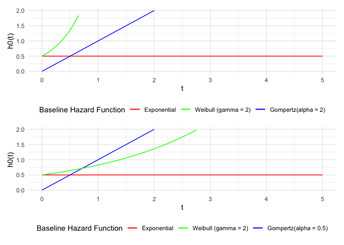
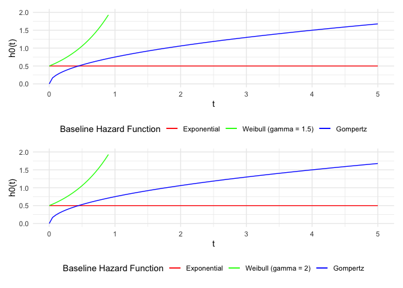

P8160 Project 1 Final Report
================
Jingchen Chai, Yi Huang, Ruihan Zhang


``` r
library(ggplot2)
library(patchwork)
```

# Plot of Baseline Hazard Function

``` r
# parameter and seed
lambda <- 0.5
set.seed(2023)


# gamma = 2, alpha = 2
exp_haz <- function(t, lambda = 0.5) lambda * 1 * t^0
weibull_haz <- function(t, lambda = 0.5, gamma = 2) lambda * gamma * t^(gamma - 1)
gompertz_haz <- function(t, lambda = 0.5, gamma = 2) lambda * exp(gamma* t)

p <- ggplot(data = data.frame(x = 0), mapping = aes(x = x))
p <- p + 
  stat_function(fun = exp_haz, aes(col = "exponential")) + 
  stat_function(fun = weibull_haz, aes(col = "weibull (gamma = 2)")) + 
  stat_function(fun = gompertz_haz, aes(col = "pink")) + 
  xlim(0,5) + 
  ylim(0,2) + 
  theme_minimal() + 
  scale_color_manual(name = "Baseline Hazard Function", 
                     values = c("red", "green", "blue"), 
                     labels = c("Exponential", "Weibull (gamma = 2)", "Gompertz(alpha = 2)" )) + 
  theme(legend.position="bottom") + 
  labs(x = "t", y = "h0(t)")

# gamma = 0.05, alpha = 0.05
exp_haz <- function(t, lambda = 0.5) lambda * 1 * t^0
weibull_haz <- function(t, lambda = 0.5, gamma = 0.05) lambda * gamma * t^(gamma - 1)
gompertz_haz <- function(t, lambda = 0.5, gamma = 0.05) lambda * exp(gamma* t)

p1 <- ggplot(data = data.frame(x = 0), mapping = aes(x = x))
p1 <- p1 + 
  stat_function(fun = exp_haz, aes(col = "exponential")) + 
  stat_function(fun = weibull_haz, aes(col = "weibull (gamma = 0.05)")) + 
  stat_function(fun = gompertz_haz, aes(col = "pink")) + 
  xlim(0,5) + 
  ylim(0,2) + 
  theme_minimal() + 
  scale_color_manual(name = "Baseline Hazard Function", 
                     values = c("red", "green", "blue"), 
                     labels = c("Exponential", "Weibull (gamma = 0.05)", "Gompertz(alpha = 0.05)" )) + 
  theme(legend.position="bottom") + 
  labs(x = "t", y = "h0(t)")

# gamma = 1, alpha = 1
exp_haz2 <- function(t, lambda = 0.5) lambda * 1 * t^0
weibull_haz2 <- function(t, lambda = 0.5, gamma = 1) lambda * gamma * t^(gamma - 1)
gompertz_haz2 <- function(t, lambda = 0.5, gamma = 1) lambda * exp(gamma* t)

p2 <- ggplot(data = data.frame(x = 0), mapping = aes(x = x))
p2 <- p2 + 
  stat_function(fun = exp_haz2, aes(col = "exponential")) + 
  stat_function(fun = weibull_haz2, aes(col = "weibull (gamma = 1)")) + 
  stat_function(fun = gompertz_haz2, aes(col = "pink")) + 
  xlim(0,5) + 
  ylim(0,2) + 
  theme_minimal() + 
  scale_color_manual(name = "Baseline Hazard Function", 
                     values = c("red", "green", "blue"), 
                     labels = c("Exponential", "Weibull (gamma = 1)", "Gompertz(alpha = 1)" )) + 
  theme(legend.position="bottom") + 
  labs(x = "t", y = "h0(t)")

# gamma = 2, alpha = 0.5
exp_haz3 <- function(t, lambda = 0.5) lambda * 1 * t^0
weibull_haz3 <- function(t, lambda = 0.5, gamma = 2) lambda * gamma * t^(gamma - 1)
gompertz_haz3 <- function(t, lambda = 0.5, gamma = 0.5) lambda * exp(gamma* t)

p3 <- ggplot(data = data.frame(x = 0), mapping = aes(x = x))
p3 <- p3 + 
  stat_function(fun = exp_haz3, aes(col = "exponential")) + 
  stat_function(fun = weibull_haz3, aes(col = "weibull (gamma = 2)")) + 
  stat_function(fun = gompertz_haz3, aes(col = "pink")) + 
  xlim(0,5) + 
  ylim(0,2) + 
  theme_minimal() + 
  scale_color_manual(name = "Baseline Hazard Function", 
                     values = c("red", "green", "blue"), 
                     labels = c("Exponential", "Weibull (gamma = 2)", "Gompertz(alpha = 0.5)" )) + 
  theme(legend.position="bottom") + 
  labs(x = "t", y = "h0(t)")

# gamma = 1.5, alpha = 1.5
exp_haz3 <- function(t, lambda = 0.5) lambda * 1 * t^0
weibull_haz3 <- function(t, lambda = 0.5, gamma = 1.5) lambda * gamma * t^(gamma - 1)
gompertz_haz3 <- function(t, lambda = 0.5, gamma = 1.5) lambda * exp(gamma* t)

p4 <- ggplot(data = data.frame(x = 0), mapping = aes(x = x))
p4 <- p4 + 
  stat_function(fun = exp_haz3, aes(col = "exponential")) + 
  stat_function(fun = weibull_haz3, aes(col = "weibull (gamma = 1.5)")) + 
  stat_function(fun = gompertz_haz3, aes(col = "pink")) + 
  xlim(0,5) + 
  ylim(0,2) + 
  theme_minimal() + 
  scale_color_manual(name = "Baseline Hazard Function", 
                     values = c("red", "green", "blue"), 
                     labels = c("Exponential", "Weibull (gamma = 1.5)", "Gompertz(alpha = 1.5)" )) + 
  theme(legend.position="bottom") + 
  labs(x = "t", y = "h0(t)")

(p/p3)
```

<!-- -->

``` r
(p3/p4)
```

<!-- -->
