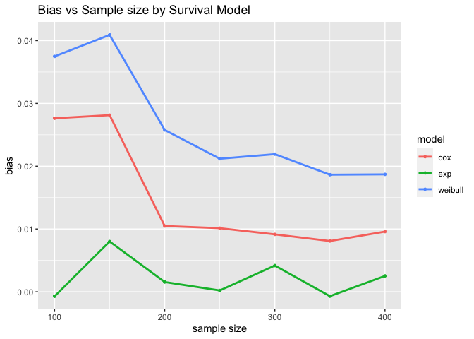
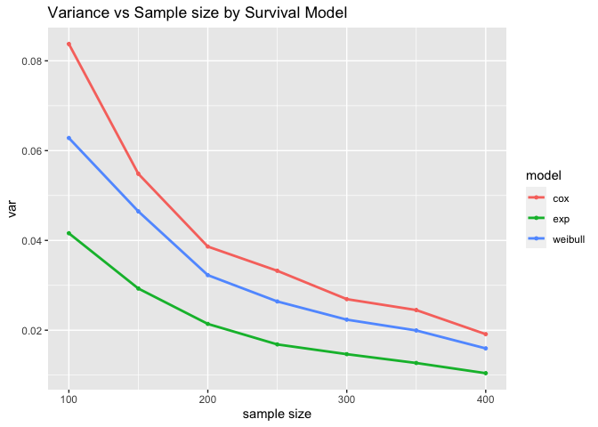
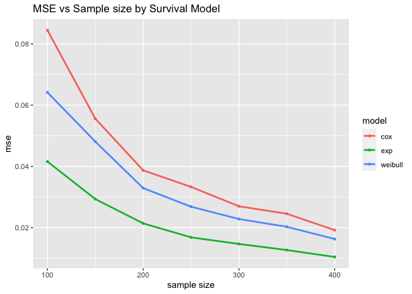
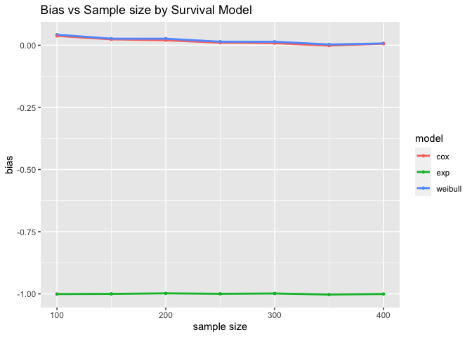
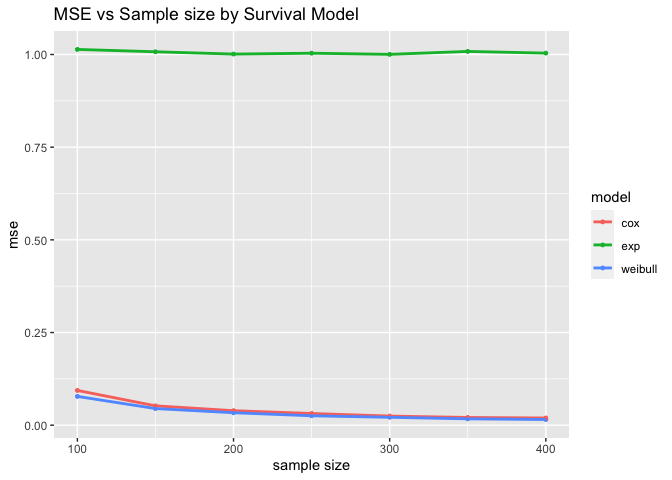
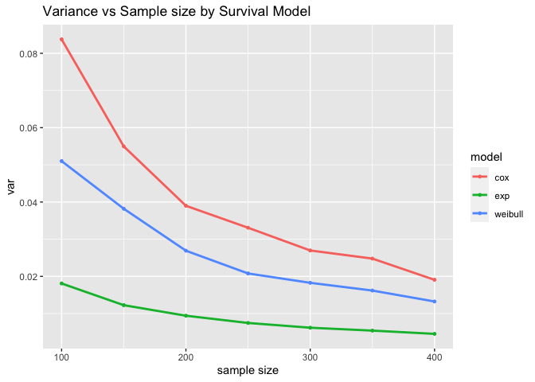
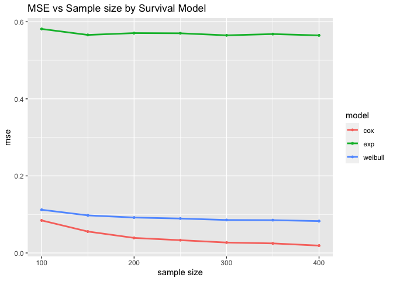
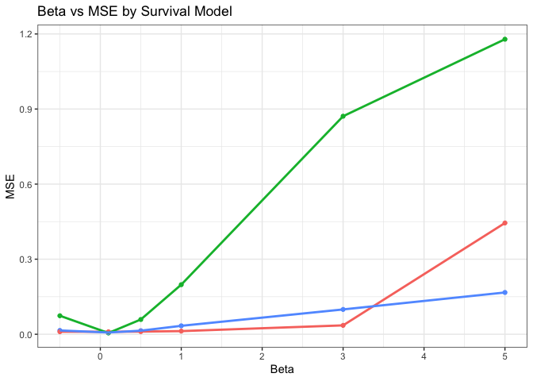
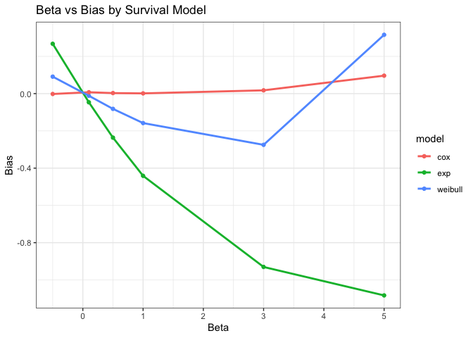
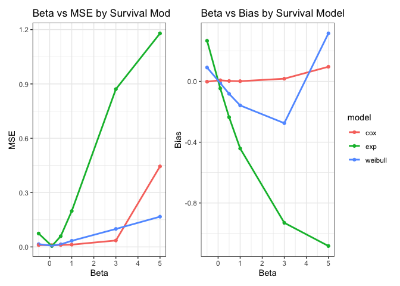

group project
================
Jingchen Chai, Yi Huang,Ruihan Zhang
2023-02-25

``` r
library(survival)
library(tidyverse)
```

    ## ── Attaching packages ─────────────────────────────────────── tidyverse 1.3.2 ──
    ## ✔ ggplot2 3.4.0     ✔ purrr   1.0.1
    ## ✔ tibble  3.1.8     ✔ dplyr   1.1.0
    ## ✔ tidyr   1.3.0     ✔ stringr 1.5.0
    ## ✔ readr   2.1.3     ✔ forcats 1.0.0
    ## ── Conflicts ────────────────────────────────────────── tidyverse_conflicts() ──
    ## ✖ dplyr::filter() masks stats::filter()
    ## ✖ dplyr::lag()    masks stats::lag()

``` r
library(gridExtra)
```

    ## 
    ## Attaching package: 'gridExtra'
    ## 
    ## The following object is masked from 'package:dplyr':
    ## 
    ##     combine

``` r
library(patchwork)
library(ggpubr)
```

# Define data generate function

``` r
simdata = function(n, distribution,b1,lambda, gamma, alpha) {
  exponential = function(u, x, lambda, b1) {
    time = -log(u) / (exp(x * b1) * lambda) }  
  weibull = function(u, x, lambda, gamma, b1) {
    time = ( -log(u) / (exp(x * b1) * lambda) ) ^ (1 / gamma) }
  gompertz = function(u, x, lambda, alpha, b1) {
    time = (1/alpha) * log( 1 - (alpha * log(u) / (lambda * exp(b1 * x))) ) }
  x = rbinom(n, 1, 0.5)
  u = runif(n)
  if (distribution == "exponential") {
    time = exponential(u, x, lambda, b1) } 
  else if (distribution == "weibull") {
    time = weibull(u, x, lambda, gamma,b1) }
  else { 
    time = gompertz(u, x, lambda, alpha, b1) } 
  
  time[time < 1/365] = 1/365
  time[time == 1 / 365] = time[time == 1 / 365] + rnorm(length(time[time == 1 / 365]), 0, 1e-4)
  time = abs(time)
  e=as.numeric(time<5)
  time=pmin(time,5)
  
  # data set
  survival_data = data.frame(id=1:n,
                             time = time,
                             x = x,
                             event=e)
}
```

# Define simulation function parameters

- lambda: scale parameter = 0.5
- gamma: shape parameter of Weibull baseline hazard function = 2
- alpha: shape parameter of Gompertz baseline hazard function = 2
- b1: true treatment effect $\beta$ = 2
- seed: set to be 2023

``` r
lambda <- 0.5
gamma <- 2
alpha <- 2
b1 <- 2
```

# Exponential Distribution Data: Bias, Variance, Mse of three survival models

## Bias

``` r
set.seed(2023)
simulate = function(sim, n, b1, dist = "exponential") {
  # Set up coefficient vectors
  exp_beta = rep(NA, sim)
  weibull_beta = rep(NA, sim)
  cox_beta = rep(NA, sim)
    for (i in 1:sim) {
      
      data = simdata(n, distribution = dist,b1, 
                           lambda, gamma, alpha)
      
      fit.exponential = survreg(Surv(data$t, data$event) ~ data$x, 
                                dist = "exponential") 
      fit.weibull = survreg(Surv(data$t, data$event) ~ data$x, 
                            dist = "weibull")
      fit.cox = coxph(Surv(data$t, data$event) ~ data$x)
      
       
      exp_beta[i] = -fit.exponential$coefficients[-1]
      weibull_beta[i] = -fit.weibull$coefficients[-1] / fit.weibull$scale
      cox_beta[i] = fit.cox$coefficients[1]
      
    }
  
  coef = tibble(exp = exp_beta,
                weibull = weibull_beta,
                cox=cox_beta)
  exp_bias = (sum(exp_beta - b1)) / sim
  weibull_bias = (sum(weibull_beta - b1)) / sim
  cox_bias = (sum(cox_beta - b1)) / sim
  
  exp_var=var(exp_beta)
  weibull_var=var(weibull_beta)
  cox_var=var(cox_beta)
  
  exp_mse=(sum((exp_beta - b1)^2)) / sim
  weibull_mse=(sum((weibull_beta - b1)^2)) / sim
  cox_mse=(sum((cox_beta - b1)^2)) / sim
  
  char = tibble(model = c("exp", "weibull","cox"),
                bias=c(exp_bias,weibull_bias,cox_bias))
  
  results = list(coef, char)
  names(results) = c("coefficients", "performance")
  return(results)
  #return(coef)
  
}

sim_results = 
  tibble(sample_size = c(100,150,200,250,300,350,400)) %>% 
  mutate(
    output= map(.x = sample_size, ~simulate(sim = 1000, n = .x, b1, 
                                                        dist = "exponential")$performance),
                output = map(.x = output, ~mutate(.x)))
temp1 = sim_results %>% unnest(output) 
ggplot(temp1, aes(x = sample_size, y = bias, color = model)) +
  geom_point(size = 1) +
  geom_line(size = 1) +
  xlab("sample size") +
  labs(title="Bias vs Sample size by Survival Model") + 
  theme(plot.caption = element_text(hjust = 0.5, size = rel(1.2)))
```

<!-- -->

``` r
ggsave(file="results/exponential_bias.pdf",width=8,height=5)
ggsave(file="graphs/2.png",width=8,height=5)
```

# Variance of three model using Exponential distribution survival data

``` r
set.seed(2023)
simulate = function(sim, n, b1, dist = "weibull") {
  # Set up coefficient vectors
  exp_beta = rep(NA, sim)
  weibull_beta = rep(NA, sim)
  cox_beta = rep(NA, sim)
    for (i in 1:sim) {
      
      data = simdata(n, distribution = dist, b1, 
                           lambda, gamma, alpha )
      
      fit.exponential = survreg(Surv(data$t, data$event) ~ data$x, 
                                dist = "exponential") 
      fit.weibull = survreg(Surv(data$t, data$event) ~ data$x, 
                            dist = "weibull")
      fit.cox = coxph(Surv(data$t, data$event) ~ data$x)
      
       
      exp_beta[i] = -fit.exponential$coefficients[-1]
      weibull_beta[i] = -fit.weibull$coefficients[-1] / fit.weibull$scale
      cox_beta[i] = fit.cox$coefficients[1]
      
    }
  
  coef = tibble(exp = exp_beta,
                weibull = weibull_beta,
                cox=cox_beta)
  exp_bias = (sum(exp_beta - b1)) / sim
  weibull_bias = (sum(weibull_beta - b1)) / sim
  cox_bias = (sum(cox_beta - b1)) / sim
  
  exp_var=var(exp_beta)
  weibull_var=var(weibull_beta)
  cox_var=var(cox_beta)
  
  exp_mse=(sum((exp_beta - b1)^2)) / sim
  weibull_mse=(sum((weibull_beta - b1)^2)) / sim
  cox_mse=(sum((cox_beta - b1)^2)) / sim
  
  char = tibble(model = c("exp", "weibull","cox"),
                var=c(exp_var,weibull_var,cox_var))
  
  results = list(coef, char)
  names(results) = c("coefficients", "performance")
  return(results)
  #return(coef)
  
}

sim_results = 
  tibble(sample_size = c(100,150,200,250,300,350,400)) %>% 
  mutate(
    output= map(.x = sample_size, ~simulate(sim = 1000, n = .x, b1, 
                                                        dist = "exponential")$performance),
                output = map(.x = output, ~mutate(.x)))
temp1 = sim_results %>% unnest(output) 
ggplot(temp1, aes(x = sample_size, y = var, color = model)) +
  geom_point(size = 1) +
  geom_line(size = 1) +
  xlab("sample size") +
  labs(title="Variance vs Sample size by Survival Model") + 
  theme(plot.caption = element_text(hjust = 0.5, size = rel(1.2)))
```

<!-- -->

``` r
ggsave(file="results/exponential_var.pdf",width=8,height=5)
ggsave(file="graphs/1.png",width=8,height=5)
```

## MSE

``` r
set.seed(2023)
simulate = function(sim, n, b1, dist = "exponential") {
  # Set up coefficient vectors
  exp_beta = rep(NA, sim)
  weibull_beta = rep(NA, sim)
  cox_beta = rep(NA, sim)
    for (i in 1:sim) {
      
      data = simdata(n, distribution = dist, b1, 
                           lambda, gamma, alpha)
      
      fit.exponential = survreg(Surv(data$t, data$event) ~ data$x, 
                                dist = "exponential") 
      fit.weibull = survreg(Surv(data$t, data$event) ~ data$x, 
                            dist = "weibull")
      fit.cox = coxph(Surv(data$t, data$event) ~ data$x)
      
       
      exp_beta[i] = -fit.exponential$coefficients[-1]
      weibull_beta[i] = -fit.weibull$coefficients[-1] / fit.weibull$scale
      cox_beta[i] = fit.cox$coefficients[1]
      
    }
  
  coef = tibble(exp = exp_beta,
                weibull = weibull_beta,
                cox=cox_beta)
  exp_bias = (sum(exp_beta - b1)) / sim
  weibull_bias = (sum(weibull_beta - b1)) / sim
  cox_bias = (sum(cox_beta - b1)) / sim
  
  exp_var=var(exp_beta)
  weibull_var=var(weibull_beta)
  cox_var=var(cox_beta)
  
  exp_mse=(sum((exp_beta - b1)^2)) / sim
  weibull_mse=(sum((weibull_beta - b1)^2)) / sim
  cox_mse=(sum((cox_beta - b1)^2)) / sim
  
  char = tibble(model = c("exp", "weibull","cox"),
                mse=c(exp_mse,weibull_mse,cox_mse))
  
  results = list(coef, char)
  names(results) = c("coefficients", "performance")
  return(results)
  #return(coef)
  
}

sim_results = 
  tibble(sample_size = c(100,150,200,250,300,350,400)) %>% 
  mutate(
    output= map(.x = sample_size, ~simulate(sim = 1000, n = .x, b1, 
                                                        dist = "exponential")$performance),
                output = map(.x = output, ~mutate(.x)))
temp1 = sim_results %>% unnest(output) 
ggplot(temp1, aes(x = sample_size, y = mse, color = model)) +
  geom_point(size = 1) +
  geom_line(size = 1) +
  xlab("sample size") +
  labs(title="MSE vs Sample size by Survival Model") + 
  theme(plot.caption = element_text(hjust = 0.5, size = rel(1.2)))
```

<!-- -->

``` r
ggsave(file="results/exponential_mse.pdf",width=8,height=5)
ggsave(file="graphs/3.png",width=8,height=5)
```

# Weibull Distribution Data: Bias, Variance, Mse of three survival models

## Bias

``` r
set.seed(2023)
simulate = function(sim, n, b1, dist = "weibull") {
  # Set up coefficient vectors
  exp_beta = rep(NA, sim)
  weibull_beta = rep(NA, sim)
  cox_beta = rep(NA, sim)
    for (i in 1:sim) {
      
      data = simdata(n, distribution = dist, b1, 
                           lambda, gamma, alpha )
      
      fit.exponential = survreg(Surv(data$t, data$event) ~ data$x, 
                                dist = "exponential") 
      fit.weibull = survreg(Surv(data$t, data$event) ~ data$x, 
                            dist = "weibull")
      fit.cox = coxph(Surv(data$t, data$event) ~ data$x)
      
       
      exp_beta[i] = -fit.exponential$coefficients[-1]
      weibull_beta[i] = -fit.weibull$coefficients[-1] / fit.weibull$scale
      cox_beta[i] = fit.cox$coefficients[1]
      
    }
  
  coef = tibble(exp = exp_beta,
                weibull = weibull_beta,
                cox=cox_beta)
  exp_bias = (sum(exp_beta - b1)) / sim
  weibull_bias = (sum(weibull_beta - b1)) / sim
  cox_bias = (sum(cox_beta - b1)) / sim
  
  exp_var=var(exp_beta)
  weibull_var=var(weibull_beta)
  cox_var=var(cox_beta)
  
  exp_mse=(sum((exp_beta - b1)^2)) / sim
  weibull_mse=(sum((weibull_beta - b1)^2)) / sim
  cox_mse=(sum((cox_beta - b1)^2)) / sim
  
  char = tibble(model = c("exp", "weibull","cox"),
                bias=c(exp_bias,weibull_bias,cox_bias))
  
  results = list(coef, char)
  names(results) = c("coefficients", "performance")
  return(results)
  #return(coef)
  
}

set.seed(2023)
sim_results = 
  tibble(sample_size = c(100,150,200,250,300,350,400)) %>% 
  mutate(
    output= map(.x = sample_size, ~simulate(sim = 1000, n = .x, b1, 
                                                        dist = "weibull")$performance),
                output = map(.x = output, ~mutate(.x)))
temp1 = sim_results %>% unnest(output) 
ggplot(temp1, aes(x = sample_size, y = bias, color = model)) +
  geom_point(size = 1) +
  geom_line(size = 1) +
  xlab("sample size") +
  labs(title="Bias vs Sample size by Survival Model") + 
  theme(plot.caption = element_text(hjust = 0.5, size = rel(1.2)))
```

<!-- -->

``` r
ggsave(file="results/weibull_bias.pdf",width=8,height=5)
ggsave(file="graphs/5.png",width=8,height=5)
```

## Variance

``` r
set.seed(2023)
simulate = function(sim, n, b1, dist = "weibull") {
  # Set up coefficient vectors
  exp_beta = rep(NA, sim)
  weibull_beta = rep(NA, sim)
  cox_beta = rep(NA, sim)
    for (i in 1:sim) {
      
      data = simdata(n, distribution = dist, b1, 
                           lambda, gamma, alpha )
      
      fit.exponential = survreg(Surv(data$t, data$event) ~ data$x, 
                                dist = "exponential") 
      fit.weibull = survreg(Surv(data$t, data$event) ~ data$x, 
                            dist = "weibull")
      fit.cox = coxph(Surv(data$t, data$event) ~ data$x)
      
       
      exp_beta[i] = -fit.exponential$coefficients[-1]
      weibull_beta[i] = -fit.weibull$coefficients[-1] / fit.weibull$scale
      cox_beta[i] = fit.cox$coefficients[1]
      
    }
  
  coef = tibble(exp = exp_beta,
                weibull = weibull_beta,
                cox=cox_beta)
  exp_bias = (sum(exp_beta - b1)) / sim
  weibull_bias = (sum(weibull_beta - b1)) / sim
  cox_bias = (sum(cox_beta - b1)) / sim
  
  exp_var=var(exp_beta)
  weibull_var=var(weibull_beta)
  cox_var=var(cox_beta)
  
  exp_mse=(sum((exp_beta - b1)^2)) / sim
  weibull_mse=(sum((weibull_beta - b1)^2)) / sim
  cox_mse=(sum((cox_beta - b1)^2)) / sim
  
  char = tibble(model = c("exp", "weibull","cox"),
                var=c(exp_var,weibull_var,cox_var))
  
  results = list(coef, char)
  names(results) = c("coefficients", "performance")
  return(results)
  #return(coef)
  
}
sim_results = 
  tibble(sample_size = c(100,150,200,250,300,350,400)) %>% 
  mutate(
    output= map(.x = sample_size, ~simulate(sim = 1000, n = .x, b1, 
                                                        dist = "weibull")$performance),
                output = map(.x = output, ~mutate(.x)))
temp1 = sim_results %>% unnest(output) 
ggplot(temp1, aes(x = sample_size, y = var, color = model)) +
  geom_point(size = 1) +
  geom_line(size = 1) +
  xlab("sample size") +
  labs(title="Variance vs Sample size by Survival Model") + 
  theme(plot.caption = element_text(hjust = 0.5, size = rel(1.2)))
```

<!-- -->

``` r
ggsave(file="results/weibull_var.pdf",width=8,height=5)
ggsave(file="graphs/4.png",width=8,height=5)
```

## MSE

``` r
set.seed(2023)
simulate = function(sim, n, b1, dist = "weibull") {
  # Set up coefficient vectors
  exp_beta = rep(NA, sim)
  weibull_beta = rep(NA, sim)
  cox_beta = rep(NA, sim)
    for (i in 1:sim) {
      
      data = simdata(n, distribution = dist,b1, 
                           lambda, gamma, alpha)
      
      fit.exponential = survreg(Surv(data$t, data$event) ~ data$x, 
                                dist = "exponential") 
      fit.weibull = survreg(Surv(data$t, data$event) ~ data$x, 
                            dist = "weibull")
      fit.cox = coxph(Surv(data$t, data$event) ~ data$x)
      
       
      exp_beta[i] = -fit.exponential$coefficients[-1]
      weibull_beta[i] = -fit.weibull$coefficients[-1] / fit.weibull$scale
      cox_beta[i] = fit.cox$coefficients[1]
      
    }
  
  coef = tibble(exp = exp_beta,
                weibull = weibull_beta,
                cox=cox_beta)
  exp_bias = (sum(exp_beta - b1)) / sim
  weibull_bias = (sum(weibull_beta - b1)) / sim
  cox_bias = (sum(cox_beta - b1)) / sim
  
  exp_var=var(exp_beta)
  weibull_var=var(weibull_beta)
  cox_var=var(cox_beta)
  
  exp_mse=(sum((exp_beta - b1)^2)) / sim
  weibull_mse=(sum((weibull_beta - b1)^2)) / sim
  cox_mse=(sum((cox_beta - b1)^2)) / sim
  
  char = tibble(model = c("exp", "weibull","cox"),
                mse=c(exp_mse,weibull_mse,cox_mse))
  
  results = list(coef, char)
  names(results) = c("coefficients", "performance")
  return(results)
  #return(coef)
  
}

sim_results = 
  tibble(sample_size = c(100,150,200,250,300,350,400)) %>% 
  mutate(
    output= map(.x = sample_size, ~simulate(sim = 1000, n = .x, b1, 
                                                        dist = "weibull")$performance),
                output = map(.x = output, ~mutate(.x)))
temp1 = sim_results %>% unnest(output) 
ggplot(temp1, aes(x = sample_size, y = mse, color = model)) +
  geom_point(size = 1) +
  geom_line(size = 1) +
  xlab("sample size") +
  labs(title="MSE vs Sample size by Survival Model") + 
  theme(plot.caption = element_text(hjust = 0.5, size = rel(1.2)))
```

<!-- -->

``` r
ggsave(file="results/weibull_mse.pdf",width=8,height=5)
ggsave(file="graphs/6.png",width=8,height=5)
```

# Gompertz Distribution Data: Bias, Variance, Mse of three survival models

## Bias

``` r
set.seed(2023)
simulate = function(sim, n, b1, dist = "gompertz") {
  # Set up coefficient vectors
  exp_beta = rep(NA, sim)
  weibull_beta = rep(NA, sim)
  cox_beta = rep(NA, sim)
    for (i in 1:sim) {
      
      data = simdata(n, distribution = dist, b1, 
                           lambda, gamma, alpha )
      
      fit.exponential = survreg(Surv(data$t, data$event) ~ data$x, 
                                dist = "exponential") 
      fit.weibull = survreg(Surv(data$t, data$event) ~ data$x, 
                            dist = "weibull")
      fit.cox = coxph(Surv(data$t, data$event) ~ data$x)
      
       
      exp_beta[i] = -fit.exponential$coefficients[-1]
      weibull_beta[i] = -fit.weibull$coefficients[-1] / fit.weibull$scale
      cox_beta[i] = fit.cox$coefficients[1]
      
    }
  
  coef = tibble(exp = exp_beta,
                weibull = weibull_beta,
                cox=cox_beta)
  exp_bias = (sum(exp_beta - b1)) / sim
  weibull_bias = (sum(weibull_beta - b1)) / sim
  cox_bias = (sum(cox_beta - b1)) / sim
  
  exp_var=var(exp_beta)
  weibull_var=var(weibull_beta)
  cox_var=var(cox_beta)
  
  exp_mse=(sum((exp_beta - b1)^2)) / sim
  weibull_mse=(sum(weibull_beta - b1^2)) / sim
  cox_mse=(sum((cox_beta - b1)^2)) / sim
  
  char = tibble(model = c("exp", "weibull","cox"),
                bias=c(exp_bias,weibull_bias,cox_bias))
  
  results = list(coef, char)
  names(results) = c("coefficients", "performance")
  return(results)
  #return(coef)
  
}

set.seed(2023)
sim_results = 
  tibble(sample_size = c(100,150,200,250,300,350,400)) %>% 
  mutate(
    output= map(.x = sample_size, ~simulate(sim = 1000, n = .x, b1, 
                                                        dist = "gompertz")$performance),
                output = map(.x = output, ~mutate(.x)))
temp1 = sim_results %>% unnest(output) 
ggplot(temp1, aes(x = sample_size, y = bias, color = model)) +
  geom_point(size = 1) +
  geom_line(size = 1) +
  xlab("sample size") +
  labs(title="Bias vs Sample size by Survival Model") + 
  theme(plot.caption = element_text(hjust = 0.5, size = rel(1.2)))
```

<!-- -->

``` r
ggsave(file="results/gompertz_bias.pdf",width=8,height=5)
ggsave(file="graphs/8.png",width=8,height=5)
```

## Variance

``` r
set.seed(2023)
simulate = function(sim, n, b1, dist = "gompertz") {
  # Set up coefficient vectors
  exp_beta = rep(NA, sim)
  weibull_beta = rep(NA, sim)
  cox_beta = rep(NA, sim)
    for (i in 1:sim) {
      
      data = simdata(n, distribution = dist, b1, 
                           lambda, gamma, alpha )
      
      fit.exponential = survreg(Surv(data$t, data$event) ~ data$x, 
                                dist = "exponential") 
      fit.weibull = survreg(Surv(data$t, data$event) ~ data$x, 
                            dist = "weibull")
      fit.cox = coxph(Surv(data$t, data$event) ~ data$x)
      
       
      exp_beta[i] = -fit.exponential$coefficients[-1]
      weibull_beta[i] = -fit.weibull$coefficients[-1] / fit.weibull$scale
      cox_beta[i] = fit.cox$coefficients[1]
      
    }
  
  coef = tibble(exp = exp_beta,
                weibull = weibull_beta,
                cox=cox_beta)
  exp_bias = (sum(exp_beta - b1)) / sim
  weibull_bias = (sum(weibull_beta - b1)) / sim
  cox_bias = (sum(cox_beta - b1)) / sim
  
  exp_var=var(exp_beta)
  weibull_var=var(weibull_beta)
  cox_var=var(cox_beta)
  
  exp_mse=(sum((exp_beta - b1)^2)) / sim
  weibull_mse=(sum((weibull_beta - b1)^2)) / sim
  cox_mse=(sum((cox_beta - b1)^2)) / sim
  
  char = tibble(model = c("exp", "weibull","cox"),
                var=c(exp_var,weibull_var,cox_var))
  
  results = list(coef, char)
  names(results) = c("coefficients", "performance")
  return(results)
  #return(coef)
  
}
sim_results = 
  tibble(sample_size = c(100,150,200,250,300,350,400)) %>% 
  mutate(
    output= map(.x = sample_size, ~simulate(sim = 1000, n = .x, b1, 
                                                        dist = "gompertz")$performance),
                output = map(.x = output, ~mutate(.x)))
temp1 = sim_results %>% unnest(output) 
ggplot(temp1, aes(x = sample_size, y = var, color = model)) +
  geom_point(size = 1) +
  geom_line(size = 1) +
  xlab("sample size") +
  labs(title="Variance vs Sample size by Survival Model") + 
  theme(plot.caption = element_text(hjust = 0.5, size = rel(1.2)))
```

<!-- -->

``` r
ggsave(file="results/gompertz_var.pdf",width=8,height=5)
ggsave(file="graphs/7.png",width=8,height=5)
```

## MSE

``` r
set.seed(2023)
simulate = function(sim, n, b1, dist = "gompertz") {
  # Set up coefficient vectors
  exp_beta = rep(NA, sim)
  weibull_beta = rep(NA, sim)
  cox_beta = rep(NA, sim)
    for (i in 1:sim) {
      
      data = simdata(n, distribution = dist,b1, 
                           lambda, gamma, alpha)
      
      fit.exponential = survreg(Surv(data$t, data$event) ~ data$x, 
                                dist = "exponential") 
      fit.weibull = survreg(Surv(data$t, data$event) ~ data$x, 
                            dist = "weibull")
      fit.cox = coxph(Surv(data$t, data$event) ~ data$x)
      
       
      exp_beta[i] = -fit.exponential$coefficients[-1]
      weibull_beta[i] = -fit.weibull$coefficients[-1] / fit.weibull$scale
      cox_beta[i] = fit.cox$coefficients[1]
      
    }
  
  coef = tibble(exp = exp_beta,
                weibull = weibull_beta,
                cox=cox_beta)
  exp_bias = (sum(exp_beta - b1)) / sim
  weibull_bias = (sum(weibull_beta - b1)) / sim
  cox_bias = (sum(cox_beta - b1)) / sim
  
  exp_var=var(exp_beta)
  weibull_var=var(weibull_beta)
  cox_var=var(cox_beta)
  
  exp_mse=(sum((exp_beta - b1)^2)) / sim
  weibull_mse=(sum((weibull_beta - b1)^2)) / sim
  cox_mse=(sum((cox_beta - b1)^2)) / sim
  
  char = tibble(model = c("exp", "weibull","cox"),
                mse=c(exp_mse,weibull_mse,cox_mse))
  
  results = list(coef, char)
  names(results) = c("coefficients", "performance")
  return(results)
  #return(coef)
  
}

sim_results = 
  tibble(sample_size = c(100,150,200,250,300,350,400)) %>% 
  mutate(
    output= map(.x = sample_size, ~simulate(sim = 1000, n = .x, b1, 
                                                        dist = "gompertz")$performance),
                output = map(.x = output, ~mutate(.x)))
temp1 = sim_results %>% unnest(output) 
ggplot(temp1, aes(x = sample_size, y = mse, color = model)) +
  geom_point(size = 1) +
  geom_line(size = 1) +
  xlab("sample size") +
  labs(title="MSE vs Sample size by Survival Model") + 
  theme(plot.caption = element_text(hjust = 0.5, size = rel(1.2)))
```

<!-- -->

``` r
ggsave(file="results/gompertz_mse.pdf",width=8,height=5)
ggsave(file="graphs/9.png",width=8,height=5)
```

# Beta

``` r
set.seed(2023)
simdata = function(n, distribution,b1,lambda, gamma, alpha) {
  exponential = function(u, x, lambda, b1) {
    time = -log(u) / (exp(x * b1) * lambda) }  
  weibull = function(u, x, lambda, gamma, b1) {
    time = ( -log(u) / (exp(x * b1) * lambda) ) ^ (1 / gamma) }
  gompertz = function(u, x, lambda, alpha, b1) {
    time = (1/alpha) * log( 1 - (alpha * log(u) / (lambda * exp(b1 * x))) ) }
  x = rbinom(n, 1, 0.5)
  u = runif(n)
  if (distribution == "exponential") {
    time = exponential(u, x, lambda, b1) } 
  else if (distribution == "weibull") {
    time = weibull(u, x, lambda, gamma,b1) }
  else { 
    time = gompertz(u, x, lambda, alpha, b1) } 
  
  time[time < 1/365] = 1/365
  time[time == 1 / 365] = time[time == 1 / 365] + rnorm(length(time[time == 1 / 365]), 0, 1e-4)
  time = abs(time)
  e=as.numeric(time<5)
  time=pmin(time,5)
  
  # data set
  survival_data = data.frame(id=1:n,
                             time = time,
                             x = x,
                             event=e)
}
```

``` r
set.seed(2023)
simulate = function(sim, n, b1, dist = "gompertz") {
  # Set up coefficient vectors
  exp_beta = rep(NA, sim)
  weibull_beta = rep(NA, sim)
  gompertz_beta = rep(NA, sim)
  
 
    
    for (i in 1:sim) {
      
      data = simdata(n, distribution = dist,b1, 
                           lambda = 0.5, gamma = 2,alpha=2)
      
      fit.exponential = survreg(Surv(data$time, data$event) ~ data$x, 
                                dist = "exponential") 
      fit.weibull = survreg(Surv(data$time, data$event) ~ data$x, 
                            dist = "weibull")
      fit.gompertz = coxph(Surv(data$time, data$event) ~ data$x)
      
       
      exp_beta[i] = -fit.exponential$coefficients[-1]
      weibull_beta[i] = -fit.weibull$coefficients[-1] / fit.weibull$scale
      gompertz_beta[i] = fit.gompertz$coefficients[1]
      
    }
    
   
  
  coef = tibble(exp = exp_beta,
                weibull = weibull_beta,
                gompertz=gompertz_beta)
  
  exp_bias = (sum(exp_beta - b1)) / sim 
  weibull_bias = (sum(weibull_beta - b1)) / sim
  gompertz_bias = (sum(gompertz_beta - b1)) / sim
  exp_MSE = (sum((b1 - exp_beta)^2)) / sim
  weibull_MSE = (sum((b1 - weibull_beta)^2)) / sim
  gompertz_MSE = (sum((b1 - gompertz_beta)^2)) / sim
  exp_var=var(exp_beta)
  weibull_var=var(weibull_beta)
  gompertz_var=var(gompertz_beta)
  char = tibble(model = c("exp", "weibull","cox"),
                bias=c(exp_bias,weibull_bias,gompertz_bias),
                mse = c(exp_MSE, weibull_MSE, gompertz_MSE),
                variance=c(exp_var,weibull_var,gompertz_var))
  
  results = list(coef, char)
  names(results) = c("coefficients", "performance")
  return(results)
  }
```

# Evaluating beta of three models

## Gompertz data

``` r
set.seed(2023)
sim_beta = 
  tibble(beta = c(-0.5, 0.1, 0.5, 1, 3, 5)) %>% 
  mutate(
    output = map(.x = beta, ~simulate(sim = 1000, n = 400, b1 = .x, 
                                                 dist = "gompertz")$performance),
    
    output = map(.x = output, ~mutate(.x)))
```

``` r
test = sim_beta %>% unnest(output)
```

``` r
beta_cox_mse=test %>% 
  ggplot(aes(x = beta, y = mse, color = model)) + 
  geom_point() +
  geom_line(size = 1) +
  labs(title = "Beta vs MSE by Survival Model",
       x = "Beta",
       y = "MSE") +
  theme_bw() + 
  theme(legend.position = "none")
beta_cox_mse
```

<!-- -->

``` r
beta_cox_bias=test %>% 
  ggplot(aes(x = beta, y = bias, color = model)) + 
  geom_point() +
  geom_line(size = 1) +
  labs(title = "Beta vs Bias by Survival Model",
       x = "Beta",
       y = "Bias") +
  theme_bw() 

beta_cox_bias
```

<!-- -->

``` r
beta_cox_mse+beta_cox_bias
```

<!-- -->

``` r
ggsave(file="results/beta_gompertz.pdf",width=8,height=5)
```

# Confidence Interval

``` r
set.seed(2023)
simdata = function(n, distribution,b1,lambda, gamma,alpha) {
  exponential = function(u, x, lambda, b1) {
    time = -log(u) / (exp(x * b1) * lambda) }  
  weibull = function(u, x, lambda, gamma, b1) {
    time = ( -log(u) / (exp(x * b1) * lambda) ) ^ (1 / gamma) }
  gompertz = function(u, x, lambda, alpha, b1) {
    time = (1/alpha) * log( 1 - (alpha * log(u) / (lambda * exp(b1 * x))) ) }
  x = rbinom(n, 1, 0.5)
  u = runif(n)
  if (distribution == "exponential") {
    time = exponential(u, x, lambda, b1) } 
  else if (distribution == "weibull") {
    time = weibull(u, x, lambda, gamma,b1) }
  else { 
    time = gompertz(u, x, lambda, alpha, b1) } 
  
  time[time < 1/365] = 1/365
  time[time == 1 / 365] = time[time == 1 / 365] + rnorm(length(time[time == 1 / 365]), 0, 1e-4)
  time = abs(time)
  e=as.numeric(time<5)
  time=pmin(time,5)
  
  # data set
  survival_data = data.frame(id=1:n,
                             time = time,
                             x = x,
                             event=e)
}
```

``` r
set.seed(2023)
simulate = function(sim, n, b1, dist = "gompertz") {
  # Set up coefficient vectors
  exp_beta = rep(NA, sim)
  weibull_beta = rep(NA, sim)
  cox_beta = rep(NA, sim)
  
 
    
    for (i in 1:sim) {
      
      data = simdata(n, distribution = dist,b1, 
                           lambda, gamma, alpha)
      
      fit.exponential = survreg(Surv(data$time, data$event) ~ data$x, 
                                dist = "exponential") 
      fit.weibull = survreg(Surv(data$time, data$event) ~ data$x, 
                            dist = "weibull")
      fit.cox = coxph(Surv(data$time, data$event) ~ data$x)
      
       
      exp_beta[i] = -fit.exponential$coefficients[-1]
      weibull_beta[i] = -fit.weibull$coefficients[-1] / fit.weibull$scale
      cox_beta[i] = fit.cox$coefficients[1]
      
    }
    
   
  
  coef = tibble(exp = exp_beta,
                weibull = weibull_beta,
                cox=cox_beta)
  
  return(coef) }
```

``` r
t1=simulate(1000,400,2)
lower_ci=quantile(t1$cox,0.025)
lower_ci
```

    ##     2.5% 
    ## 1.760495

``` r
upper_ci=quantile(t1$cox,0.975)
upper_ci
```

    ##    97.5% 
    ## 2.307567
