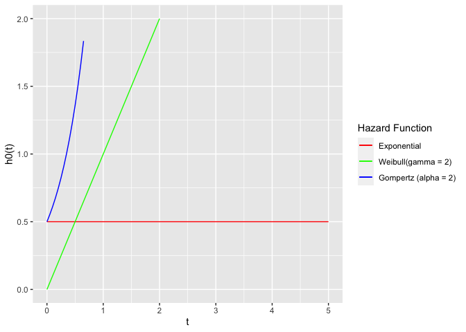
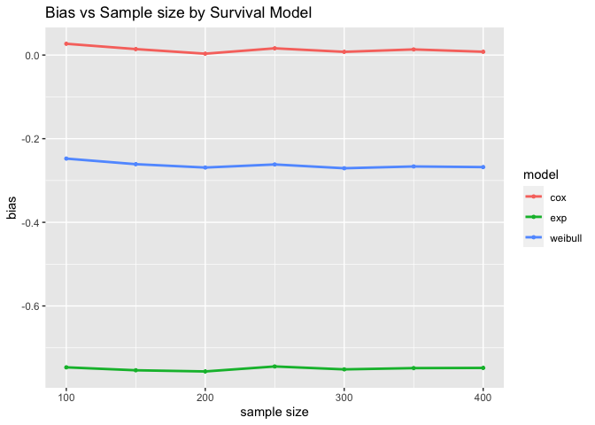
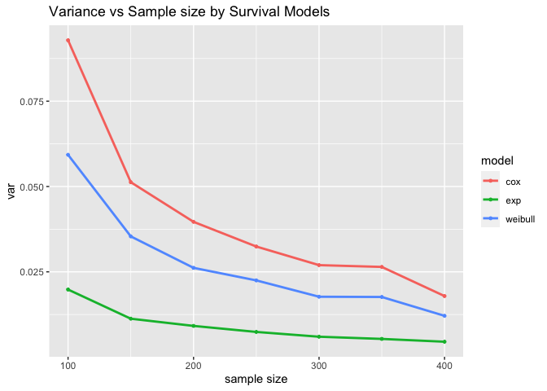
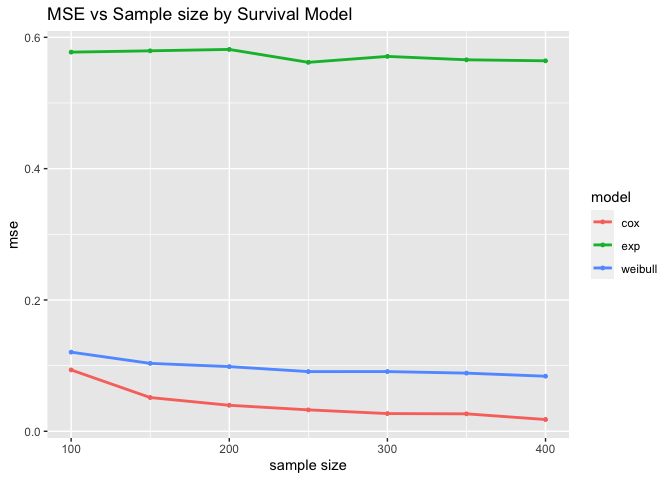
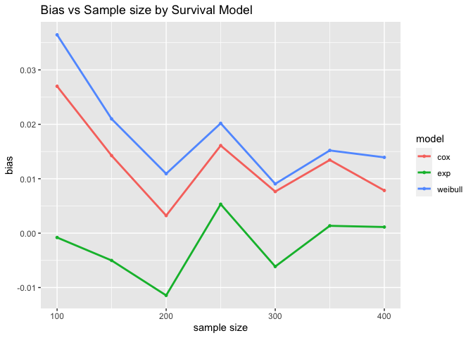
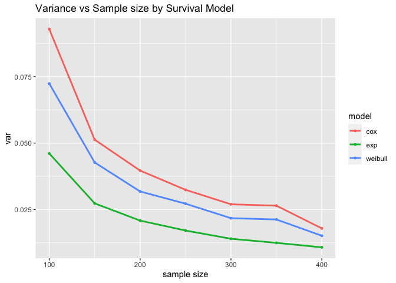
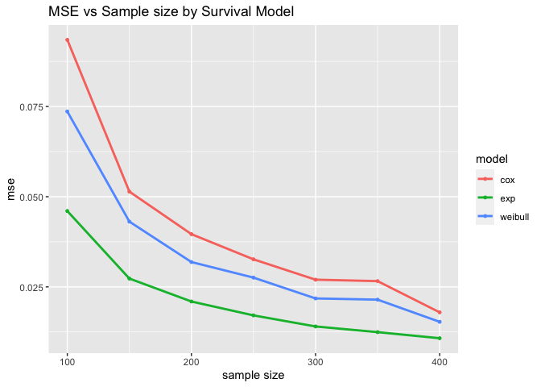
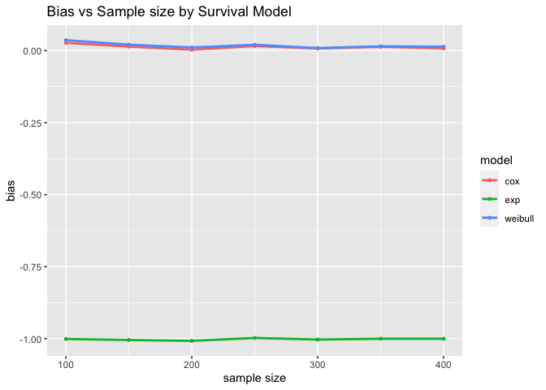
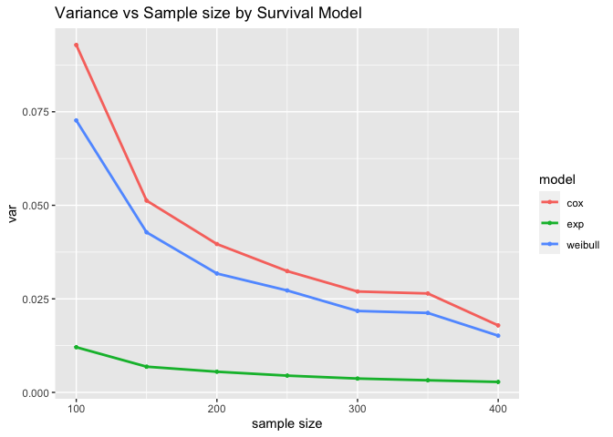
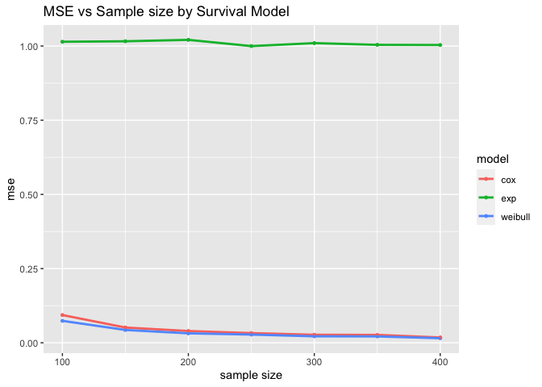

P8160_Project1_Survival
================
Yi Huang
2023-02-19

# Project 1: Design a simulation study to compare three survival models

# Plot of Baseline Hazard Function

``` r
# parameter and seed
set.seed(2023)

# gamma = 2, alpha = 2
exp_haz <- function(t, lambda = 0.5) {lambda * 1 * t^0}
weibull_haz_2 <- function(t, lambda = 0.5) lambda * 2 * t^(2 - 1)
gompertz_haz_2 <- function(t, lambda = 0.5) lambda * exp(2* t)

p1 <- ggplot(data.frame(x=c(0, 5)), aes(x=x)) + 
    geom_path(aes(colour="red"), stat="function", fun=exp_haz)+
    geom_path(aes(colour="green"), stat="function", fun=weibull_haz_2)+
    geom_path(aes(colour="blue"), stat="function", fun=gompertz_haz_2) +
    scale_colour_identity("Hazard Function", guide="legend", 
                          labels = c("Exponential", "Weibull(gamma = 2)", "Gompertz (alpha = 2)"), 
                          breaks = c("red", "green", "blue")) +
    labs(x = "t",
         y = "h0(t)") + ylim(0,2)
p1
```



# Simulation for Gompertz Baseline Hazard Function

- N: sample size 100, 150, 200, 250, 300, 350, 400
- m: simulation time 1000
- $\beta$: true treatment effect to be 2
- $\lambda$: 0.5
- $\alpha$: 2 ($\gamma$ in following function represent the shape
  parameter of gompertz)

``` r
#write a fn to simulate gompertz data
sim_gompertz <- function(k, gamma, N){
  #generate gompertz data
  covs <- data.frame(id = 1:N,
                    trt = stats::rbinom(N, 1, 0.5))
  dat <- simsurv(dist = "gompertz",
                 lambdas = 0.5, 
                 gammas = gamma, 
                 betas = c(trt = 2), 
                 x = covs, 
                 maxt = 5)
  dat <- merge(covs, dat)
  #fit models
  fit.exponential <- survreg(Surv(eventtime, status) ~ trt, data = dat, dist = "exponential")
  fit.weibull <- survreg(Surv(eventtime, status) ~ trt, data = dat, dist = "weibull")
  fit.cox <- coxph(Surv(eventtime, status) ~ trt, data = dat)
  
  #extract beta
  result <- tibble(exp_beta = c(-fit.exponential$coefficients[-1]), 
                  weibull_beta = c(-fit.weibull$coefficients[-1])/fit.weibull$scale,
                  cox_beta = c(fit.cox$coefficients), 
                  dist = "gompertz",
                  beta = 2, 
                  gamma = gamma,
                  N = N)
  return(result)
  }

# Set seed for reproducibility
set.seed(2023)

# Create empty dataframe to store results
sim_gompertz_result4 <- data.frame()

#gamma=2
set.seed(2023)
for (n in c(100, 150, 200, 250, 300, 350, 400)) {
for (i in 1:1000) {
  sim_res <- sim_gompertz(gamma = 2, N = n)
  sim_gompertz_result4  <- rbind(sim_gompertz_result4 , sim_res)
}
}

gompertz_table4 <- sim_gompertz_result4  %>% 
  group_by(N) %>%
  summarize(mse_exp = mean((exp_beta-2)^2),
            mse_weibull = mean((weibull_beta-2)^2),
            mse_cox = mean((cox_beta-2)^2),
            var_exp = var(exp_beta),
            var_weibull = var(weibull_beta),
            var_cox = var(cox_beta),
            bias_exp = mean(exp_beta-2),
            bias_weibull = mean(weibull_beta-2),
            bias_cox = mean(cox_beta-2)
        
  ) 
gompertz_table4  
```

    ## # A tibble: 7 × 10
    ##       N mse_exp mse_we…¹ mse_cox var_exp var_w…² var_cox bias_…³ bias_…⁴ bias_…⁵
    ##   <dbl>   <dbl>    <dbl>   <dbl>   <dbl>   <dbl>   <dbl>   <dbl>   <dbl>   <dbl>
    ## 1   100   0.577   0.121   0.0935 0.0198   0.0593  0.0928  -0.747  -0.248 0.0270 
    ## 2   150   0.579   0.103   0.0514 0.0113   0.0354  0.0513  -0.754  -0.261 0.0142 
    ## 3   200   0.582   0.0985  0.0396 0.00916  0.0262  0.0396  -0.757  -0.269 0.00323
    ## 4   250   0.562   0.0909  0.0326 0.00739  0.0225  0.0324  -0.745  -0.262 0.0161 
    ## 5   300   0.571   0.0910  0.0270 0.00599  0.0177  0.0270  -0.752  -0.271 0.00764
    ## 6   350   0.566   0.0886  0.0266 0.00535  0.0176  0.0264  -0.749  -0.266 0.0135 
    ## 7   400   0.564   0.0839  0.0179 0.00452  0.0121  0.0179  -0.748  -0.268 0.00784
    ## # … with abbreviated variable names ¹​mse_weibull, ²​var_weibull, ³​bias_exp,
    ## #   ⁴​bias_weibull, ⁵​bias_cox

``` r
gompertz_table4 <- gompertz_table4 %>% 
  pivot_longer(mse_exp:bias_cox, values_to = "performance", names_to = "method") %>% separate_wider_delim(method, "_", names = c("method", "model")) %>%
  pivot_wider(names_from = method, values_from = performance)
gompertz_table4
```

    ## # A tibble: 21 × 5
    ##        N model      mse     var     bias
    ##    <dbl> <chr>    <dbl>   <dbl>    <dbl>
    ##  1   100 exp     0.577  0.0198  -0.747  
    ##  2   100 weibull 0.121  0.0593  -0.248  
    ##  3   100 cox     0.0935 0.0928   0.0270 
    ##  4   150 exp     0.579  0.0113  -0.754  
    ##  5   150 weibull 0.103  0.0354  -0.261  
    ##  6   150 cox     0.0514 0.0513   0.0142 
    ##  7   200 exp     0.582  0.00916 -0.757  
    ##  8   200 weibull 0.0985 0.0262  -0.269  
    ##  9   200 cox     0.0396 0.0396   0.00323
    ## 10   250 exp     0.562  0.00739 -0.745  
    ## # … with 11 more rows

``` r
write.csv(gompertz_table4,"table/gompertz_result_table4.csv")

## Models comparison: Bias of three models using Gompertz data 
gompertz_bias <- gompertz_table4 %>% 
  ggplot(aes(x = N, y = bias, color = model)) +
  geom_point(size = 1) +
  geom_line(size = 1) +
  xlab("sample size") +
  labs(title="Bias vs Sample size by Survival Model") + 
  theme(plot.caption = element_text(hjust = 0.5, size = rel(1.2)))
gompertz_bias
```



``` r
ggsave("results/gompertz_bias.pdf", height = 5, width = 8)
ggsave("results2/gompertz_bias.pdf", height = 5, width = 8)

## Models comparison: Variance of three models using Gompertz data 
gompertz_var <- gompertz_table4 %>% 
  ggplot(aes(x = N, y = var, color = model)) +
  geom_point(size = 1) +
  geom_line(size = 1) +
  xlab("sample size") +
  labs(title="Variance vs Sample size by Survival Model") + 
  theme(plot.caption = element_text(hjust = 0.5, size = rel(1.2)))
gompertz_var
```



``` r
ggsave("results/gompertz_var.pdf", height = 5, width = 8)
ggsave("results2/gompertz_var.pdf", height = 5, width = 8)

## Models comparison: Variance of three models using Gompertz data 
gompertz_mse <- gompertz_table4 %>% 
  ggplot(aes(x = N, y = mse, color = model)) +
  geom_point(size = 1) +
  geom_line(size = 1) +
  xlab("sample size") +
  labs(title="MSE vs Sample size by Survival Model") + 
  theme(plot.caption = element_text(hjust = 0.5, size = rel(1.2)))
gompertz_mse
```



``` r
ggsave("results/gompertz_mse.pdf", height = 5, width = 8)
ggsave("results2/gompertz_mse.pdf", height = 5, width = 8)
```

# Simulation for Exponential Baseline Hazard Function

- N: sample size 100, 150, 200, 250, 300, 350, 400
- m: simulation time 1000
- $\beta$: true treatment effect to be 2
- $\lambda$: 0.5

``` r
#write a fn to simulate exponential data
sim_exp <- function(k, N){
  #generate exponential data
  covs <- data.frame(id = 1:N,
                    trt = stats::rbinom(N, 1, 0.5))
  dat <- simsurv(dist = "exponential",
                 lambdas = 0.5, 
                 betas = c(trt = 2), 
                 x = covs, 
                 maxt = 5)
  dat <- merge(covs, dat)
  #fit models
  fit.exponential <- survreg(Surv(eventtime, status) ~ trt, data = dat, dist = "exponential")
  fit.weibull <- survreg(Surv(eventtime, status) ~ trt, data = dat, dist = "weibull")
  fit.cox <- coxph(Surv(eventtime, status) ~ trt, data = dat)
  
  #extract beta
  result <- tibble(exp_beta = c(-fit.exponential$coefficients[-1]), 
                  weibull_beta = c(-fit.weibull$coefficients[-1])/fit.weibull$scale,
                  cox_beta = c(fit.cox$coefficients), 
                  dist = "exponential",
                  beta = 2, 
                  gamma = "default",
                  N = N)
  return(result)
  }

# Set seed for reproducibility
set.seed(2023)

# Create empty dataframe to store results
sim_exp_result1  <- data.frame()

# Simulate 1000 times
for (n in c(100, 150, 200, 250, 300, 350, 400)) {
for (i in 1:1000) {
  sim_res <- sim_exp(N = n)
  sim_exp_result1 <- rbind(sim_exp_result1, sim_res)
}
}

exponential_table <- sim_exp_result1 %>% 
  group_by(N) %>%
  summarize(mse_exp = mean((exp_beta-2)^2),
            mse_weibull = mean((weibull_beta-2)^2),
            mse_cox = mean((cox_beta-2)^2),
            var_exp = var(exp_beta),
            var_weibull = var(weibull_beta),
            var_cox = var(cox_beta),
            bias_exp = mean(exp_beta-2),
            bias_weibull = mean(weibull_beta-2),
            bias_cox = mean(cox_beta-2)
        
  )

exponential_table
```

    ## # A tibble: 7 × 10
    ##       N mse_exp mse_w…¹ mse_cox var_exp var_w…² var_cox bias_exp bias_…³ bias_…⁴
    ##   <dbl>   <dbl>   <dbl>   <dbl>   <dbl>   <dbl>   <dbl>    <dbl>   <dbl>   <dbl>
    ## 1   100  0.0460  0.0736  0.0935  0.0461  0.0724  0.0928 -7.96e-4 0.0365  0.0270 
    ## 2   150  0.0273  0.0431  0.0514  0.0273  0.0427  0.0513 -5.02e-3 0.0210  0.0142 
    ## 3   200  0.0209  0.0319  0.0396  0.0208  0.0318  0.0396 -1.14e-2 0.0109  0.00323
    ## 4   250  0.0171  0.0276  0.0326  0.0171  0.0272  0.0324  5.32e-3 0.0202  0.0161 
    ## 5   300  0.0140  0.0218  0.0270  0.0140  0.0217  0.0270 -6.13e-3 0.00906 0.00764
    ## 6   350  0.0125  0.0215  0.0266  0.0125  0.0213  0.0264  1.35e-3 0.0152  0.0134 
    ## 7   400  0.0108  0.0153  0.0179  0.0108  0.0151  0.0179  1.13e-3 0.0139  0.00784
    ## # … with abbreviated variable names ¹​mse_weibull, ²​var_weibull, ³​bias_weibull,
    ## #   ⁴​bias_cox

``` r
exponential_table <- exponential_table %>% 
  pivot_longer(mse_exp:bias_cox, values_to = "performance", names_to = "method") %>% separate_wider_delim(method, "_", names = c("method", "model")) %>%
  pivot_wider(names_from = method, values_from = performance)
exponential_table
```

    ## # A tibble: 21 × 5
    ##        N model      mse    var      bias
    ##    <dbl> <chr>    <dbl>  <dbl>     <dbl>
    ##  1   100 exp     0.0460 0.0461 -0.000796
    ##  2   100 weibull 0.0736 0.0724  0.0365  
    ##  3   100 cox     0.0935 0.0928  0.0270  
    ##  4   150 exp     0.0273 0.0273 -0.00502 
    ##  5   150 weibull 0.0431 0.0427  0.0210  
    ##  6   150 cox     0.0514 0.0513  0.0142  
    ##  7   200 exp     0.0209 0.0208 -0.0114  
    ##  8   200 weibull 0.0319 0.0318  0.0109  
    ##  9   200 cox     0.0396 0.0396  0.00323 
    ## 10   250 exp     0.0171 0.0171  0.00532 
    ## # … with 11 more rows

``` r
write.csv(exponential_table,"table/exponential_result_table.csv")

## Models comparison: Variance of three models using exponential data 
exponential_bias <- exponential_table %>% 
  ggplot(aes(x = N, y = bias, color = model)) +
  geom_point(size = 1) +
  geom_line(size = 1) +
  xlab("sample size") +
  labs(title="Bias vs Sample size by Survival Model") + 
  theme(plot.caption = element_text(hjust = 0.5, size = rel(1.2)))
exponential_bias
```



``` r
ggsave("results2/exponential_bias.pdf", height = 5, width = 8)

## Models comparison: Variance of three models using exponential data 
exponential_var <- exponential_table %>% 
  ggplot(aes(x = N, y = var, color = model)) +
  geom_point(size = 1) +
  geom_line(size = 1) +
  xlab("sample size") +
  labs(title="Variance vs Sample size by Survival Model") + 
  theme(plot.caption = element_text(hjust = 0.5, size = rel(1.2)))
exponential_var
```



``` r
ggsave("results2/exponential_var.pdf", height = 5, width = 8)

## Models comparison: MSE of three models using exponential data 
exponential_mse <- exponential_table %>% 
  ggplot(aes(x = N, y = mse, color = model)) +
  geom_point(size = 1) +
  geom_line(size = 1) +
  xlab("sample size") +
  labs(title="MSE vs Sample size by Survival Model") + 
  theme(plot.caption = element_text(hjust = 0.5, size = rel(1.2)))
exponential_mse
```



``` r
ggsave("results2/exponential_mse.pdf", height = 5, width = 8)
```

# Simulation for Weibull Baseline Hazard Function

- N: sample size 100, 150, 200, 250, 300, 350, 400
- m: simulation time 1000
- $\beta$: true treatment effect to be 2
- $\lambda$: 0.5
- $\gamma = \alpha$: 2

``` r
#write a fn to simulate weibull data
sim_weibull <- function(k, gamma, N){
  #generate weibull data
  covs <- data.frame(id = 1:N,
                    trt = stats::rbinom(N, 1, 0.5))
  dat <- simsurv(dist = "weibull",
                 lambdas = 0.5, 
                 gammas = gamma, 
                 betas = c(trt = 2), 
                 x = covs, 
                 maxt = 5)
  dat <- merge(covs, dat)
  #fit models
  fit.exponential <- survreg(Surv(eventtime, status) ~ trt, data = dat, dist = "exponential")
  fit.weibull <- survreg(Surv(eventtime, status) ~ trt, data = dat, dist = "weibull")
  fit.cox <- coxph(Surv(eventtime, status) ~ trt, data = dat)
  
  #extract beta
  result <- tibble(exp_beta = c(-fit.exponential$coefficients[-1]), 
                  weibull_beta = c(-fit.weibull$coefficients[-1])/fit.weibull$scale,
                  cox_beta = c(fit.cox$coefficients), 
                  dist = "weibull",
                  beta = 2, 
                  gamma = gamma,
                  N = N)
  return(result)
  }

# Set seed for reproducibility
set.seed(2023)

# Create empty dataframe to store results
sim_weibull_result4 <- data.frame()

# gamma=2
for (n in c(100, 150, 200, 250, 300, 350, 400)) {
for (i in 1:1000) {
  sim_res <- sim_weibull(gamma = 2, N = n)
  sim_weibull_result4 <- rbind(sim_weibull_result4, sim_res)
}
}

weibull_table4 <- sim_weibull_result4 %>% 
  group_by(N) %>%
  summarize(mse_exp = mean((exp_beta-2)^2),
            mse_weibull = mean((weibull_beta-2)^2),
            mse_cox = mean((cox_beta-2)^2),
            var_exp = var(exp_beta),
            var_weibull = var(weibull_beta),
            var_cox = var(cox_beta),
            bias_exp = mean(exp_beta-2),
            bias_weibull = mean(weibull_beta-2),
            bias_cox = mean(cox_beta-2)
        
  )
weibull_table4 <- weibull_table4 %>% 
  pivot_longer(mse_exp:bias_cox, values_to = "performance", names_to = "method") %>% separate_wider_delim(method, "_", names = c("method", "model")) %>%
  pivot_wider(names_from = method, values_from = performance)
weibull_table4
```

    ## # A tibble: 21 × 5
    ##        N model      mse     var     bias
    ##    <dbl> <chr>    <dbl>   <dbl>    <dbl>
    ##  1   100 exp     1.01   0.0121  -1.00   
    ##  2   100 weibull 0.0739 0.0727   0.0365 
    ##  3   100 cox     0.0935 0.0928   0.0270 
    ##  4   150 exp     1.02   0.00687 -1.00   
    ##  5   150 weibull 0.0432 0.0428   0.0209 
    ##  6   150 cox     0.0514 0.0513   0.0142 
    ##  7   200 exp     1.02   0.00553 -1.01   
    ##  8   200 weibull 0.0319 0.0318   0.0110 
    ##  9   200 cox     0.0396 0.0396   0.00323
    ## 10   250 exp     1.00   0.00448 -0.998  
    ## # … with 11 more rows

``` r
write.csv(weibull_table4,"table/weibull_result_table4.csv")


## Models comparison: Bias of three models using weibull data 
weibull_bias <- weibull_table4 %>% 
  ggplot(aes(x = N, y = bias, color = model)) +
  geom_point(size = 1) +
  geom_line(size = 1) +
  xlab("sample size") +
  labs(title="Bias vs Sample size by Survival Model") + 
  theme(plot.caption = element_text(hjust = 0.5, size = rel(1.2)))
weibull_bias
```



``` r
ggsave("results2/weibull_bias.pdf", height = 5, width = 8)

## Models comparison: Variance of three models using weibull data 
weibull_var <- weibull_table4 %>% 
  ggplot(aes(x = N, y = var, color = model)) +
  geom_point(size = 1) +
  geom_line(size = 1) +
  xlab("sample size") +
  labs(title="Variance vs Sample size by Survival Model") + 
  theme(plot.caption = element_text(hjust = 0.5, size = rel(1.2)))
weibull_var
```



``` r
ggsave("results2/weibull_var.pdf", height = 5, width = 8)

## Models comparison: MSE of three models using weibull data 
weibull_mse <- weibull_table4 %>% 
  ggplot(aes(x = N, y = mse, color = model)) +
  geom_point(size = 1) +
  geom_line(size = 1) +
  xlab("sample size") +
  labs(title="MSE vs Sample size by Survival Model") + 
  theme(plot.caption = element_text(hjust = 0.5, size = rel(1.2)))
weibull_mse
```



``` r
ggsave("results2/weibull_mse.pdf", height = 5, width = 8)
```

# Comparing the accuracy and efficiency of treatment effect ($\beta$)

*k*: the number of independent data sets  

#### Bias

*Exponential Proportional-Hazards Model*:  
$$Bias=\frac{1}{k}\sum_{i=1}^k(\hat{\beta_{exp}^{(k)}}-\beta_{1})=\frac{1}{k}\sum_{i=1}^k(\hat{\beta_{exp}^{(k)}}-0.5)$$  

*Weibull Proportional-Hazards Model*:  
$$Bias=\frac{1}{k}\sum_{i=1}^k(\hat{\beta_{weibull}^{(k)}}-\beta_{1})=\frac{1}{k}\sum_{i=1}^k(\hat{\beta_{weibull}^{(k)}}-0.5)$$  

*Cox Proportional-Hazards Model*:  
$$Bias=\frac{1}{k}\sum_{i=1}^k(\hat{\beta_{cox}^{(k)}}-\beta_{1})=\frac{1}{k}\sum_{i=1}^k(\hat{\beta_{cox}^{(k)}}-0.5)$$  

#### Variance

*Exponential Proportional-Hazards Model*:  
$$Variance= \frac{1}{k-1}\sum_{i=1}^k\hat{(\beta_{exp}^{(k)}}-\beta_{1})^2=\frac{1}{k-1}\sum_{i=1}^k\hat{(\beta_{exp}^{(k)}}-0.5)^2$$  

*Weibull Proportional-Hazards Model*:  
$$Variance= \frac{1}{k-1}\sum_{i=1}^k\hat{(\beta_{weibull}^{(k)}}-\beta_{1})^2=\frac{1}{k-1}\sum_{i=1}^k\hat{(\beta_{weibull}^{(k)}}-0.5)^2$$  

*Cox Proportional-Hazards Model*:  
$$Variance= \frac{1}{k-1}\sum_{i=1}^k\hat{(\beta_{cox}^{(k)}}-\beta_{1})^2=\frac{1}{k-1}\sum_{i=1}^k\hat{(\beta_{cox}^{(k)}}-0.5)^2$$  

#### MSE

*Exponential Proportional-Hazards Model*:  
$$MSE= \frac{1}{k}\sum_{i=1}^k(\hat{\beta_{exp}^{(k)}}-\beta_{1})^2=\frac{1}{k}\sum_{i=1}^k(\hat{\beta_{exp}^{(k)}}-0.5)^2$$  

*Weibull Proportional-Hazards Model*:  
$$MSE= \frac{1}{k}\sum_{i=1}^k(\hat{\beta_{weibull}^{(k)}}-\beta_{1})^2=\frac{1}{k}\sum_{i=1}^k(\hat{\beta_{weibull}^{(k)}}-0.5)^2$$  

*Cox Proportional-Hazards Model*:  
$$MSE= \frac{1}{k}\sum_{i=1}^k(\hat{\beta_{cox}^{(k)}}-\beta_{1})^2=\frac{1}{k}\sum_{i=1}^k(\hat{\beta_{cox}^{(k)}}-0.5)^2$$  

#### Confidence Interval

$$Coverage: \frac{1}{k}\sum_{i=1}^kI\{\beta\in CI^{(k)}\}$$
